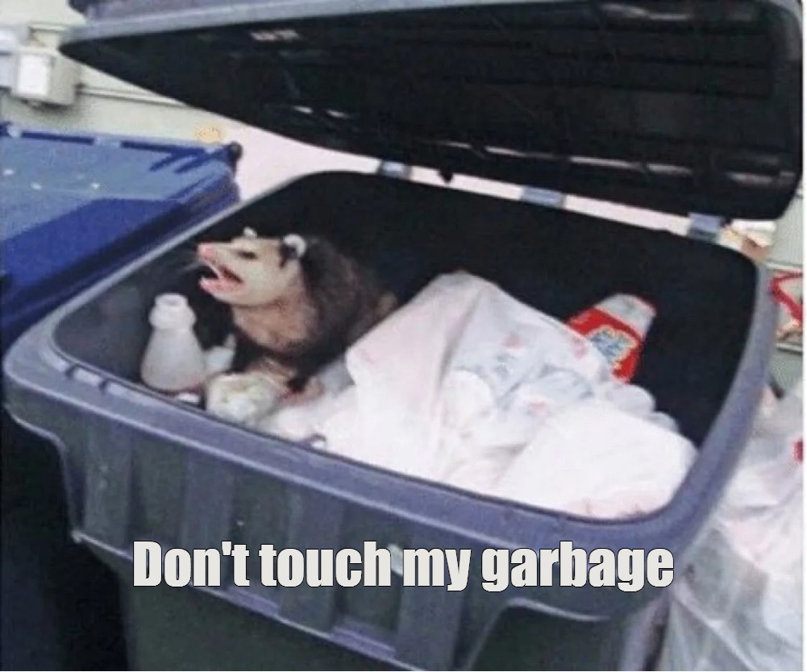
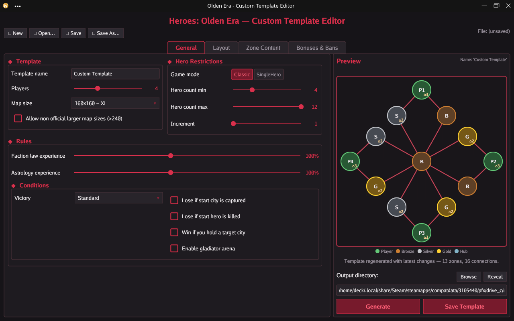

# Heroes of Might and Magic: Olden Era - Custom Templates

A desktop GUI for designing and generating `.rmg.json` random map templates for
**Heroes of Might and Magic: Olden Era**.

DISCLAIMER: This is a semi-AI generated rewrite of the original [Olden Era - Template Generator](https://github.com/KhanDevelopsGames/Olden-Era---Template-Generator)
for personal use, developing on Windows and using on Linux (SteamDeck).
All credit and inspiration goes to the people behind that project.
Don't use this project, instead go to the original.
Don't contribute to this project - some of this stuff is already AI generated,
I don't want to maintain other people code on top of that.


The app lets you configure every knob the game's RMG exposes (players, map
size, topology, zone counts, victory conditions, neutral zone quality
distribution, mandatory content, etc.), preview the resulting layout in a
side panel, persist your work as a `.gen.json` settings file, and emit a
ready-to-drop-in `.rmg.json` template.

How it looks on SteamDeck:


Generated template preview:


## Project Structure

```
.
├── main.go                                  # Process entry
├── go.mod
├── data/
│   ├── ExampleTemplates/                    # 57 reference .rmg.json templates
│   └── GameData/GeneratorData/              # Game configuration & content pools
│       ├── generator_config.json
│       ├── generator_environment_assets.json
│       ├── generator_stats_config.json
│       ├── content_lists/
│       ├── content_pools/
│       ├── encounter_templates/
│       └── zone_layouts/
├── app/                                     # Front-ends (presentation only)
│   ├── gui/                                 # Gio desktop GUI
│   │   ├── program.go                       # Gio app bootstrap + event loop
│   │   ├── editor/                          # Window, tabs, toolbar
│   │   ├── panels/                          # General / Layout / Zone Content / Bonuses & Bans / preview / footer
│   │   ├── dialogs/                         # Bonus, item/spell pickers, rule + zone editor dialogs
│   │   ├── components/                      # Dropdown + segment-button widgets
│   │   ├── widgets/                         # Reusable buttons, sliders, sections, textboxes…
│   │   ├── drivers/                         # UI state, tabs, dialog host (calls handlers)
│   │   ├── interfaces/                      # GUI ports plus panel / dialog interfaces
│   │   ├── themes/                          # Color palette + Gio material theme (single color source)
│   │   ├── constants/                       # UI-only constants
│   │   └── utils/                           # Shared drawing, math and SID lookup helpers
│   ├── tui/                                 # Placeholder for a future terminal UI
│   └── web/                                 # Placeholder for a future web UI
├── internal/
│   ├── handlers/                            # Thin GUIHandler facade over focused use-case handlers
│   ├── dtos/                                # Editor-state / template transfer objects
│   ├── common/                              # Shared errors, constants and immutable catalogs
│   ├── registry/                            # Pure game SIDs / enum pools (items, spells, factions…)
│   ├── helpers/                             # IO (Steam VDF detect), math, slice, string, linq
│   ├── entities/                            # Read-only .rmg.json schema (template/ + re-export aliases)
│   ├── mappers/                             # Editor-state DTO to generator-config mapping
│   ├── models/                              # GeneratorConfig + settings, mappings, plans, tuning
│   │   └── config/                          # GeneratorConfig (config_inner: topology, zone, hero, rules)
│   ├── validators/                          # Editor-state validation rules
│   └── services/                            # Business logic
│       ├── asset_provider/                  # Embedded game-data and preview assets
│       ├── builders/                        # Invariant-rich template entity builders
│       ├── connection_editor/               # Manual zone/connection editing logic
│       ├── content_rules/                   # Per-row content placement rules and catalogs
│       ├── file_service/                    # .gen.json and .rmg.json persistence
│       ├── preview_service/                 # Preview layout and PNG rendering
│       ├── template_generator/              # Generator + topology/content/rule providers
│       └── zones/                           # Shared zone, castle and road construction
└── test/                                    # Unit, architecture, integration and performance suites
```

## Features

- **Gio desktop GUI** (`gioui.org v0.10.0`) with four configuration tabs, a
  live preview sidebar and a generate/save footer:
  1. **General** — template name, players, map size, game mode, hero counts,
     faction-laws & astrology XP, victory condition and win/loss rules
     (lost city/hero, hold city, gladiator arena, tournament).
  2. **Layout** — topology, manual zone editor, connectivity (roads, portals,
     footholds, player isolation, faction matching, neutral spacing), zone
     sizes, difficulty/density, and advanced per-tier neutral-zone counts.
  3. **Zone Content** — mandatory content seeded per zone tier (Player / Low /
     Medium / High / Hub) across mines, utilities, treasures, recruitment,
     banks and hero-improvement groups, each with optional placement rules.
  4. **Bonuses & Bans** (experimental) — game-start bonuses, banned items,
     banned spells and guard-value overrides, edited through picker dialogs.
- **Layered architecture** — the GUI talks to `internal/handlers.GUIHandler`
  through DTOs; all generation, IO and preview logic lives in
  `internal/services`.
- **Steam auto-detection** — on launch the app locates the game's
  custom-template folder (or install `map_templates`) by parsing Steam's
  `libraryfolders.vdf`, and falls back to the working directory. Works on
  Windows and Linux/Steam Deck.
- **Manual zone editor** — visually add, move and reconnect zones over a
  generated template before saving.
- **Live preview + PNG export** — renders the topology with in-game-style
  sprites and writes a `<Name>.png` next to the template on save.
- **Settings persistence** — load/save editor state as `.gen.json`; emit
  `.rmg.json` templates compatible with the in-game RMG.
- **Eleven topologies**, map sizes 64–240 (experimental up to 512), 2–8 players,
  quality-tiered neutral zones, and content-count limits.

## Building & Running

Requires **Go 1.26.5** or later (see [go.mod](go.mod)).

```powershell
# Run directly
go run .

# Build a binary
go build .
.\hommoe_custom_templates.exe
```

Hot reload via [air](https://github.com/air-verse/air) is configured in
[.air.toml](.air.toml); set `HOT_RELOAD=1` to start the window minimized.

## Workflow

1. Launch the GUI (`go run .`). On startup it tries to locate the game's
   template folder via Steam and pre-fills the output directory.
2. Configure the template across the **General**, **Layout**, **Zone Content**
   and **Bonuses & Bans** tabs.
3. (Optional) On the **Layout** tab open the **Manual zone editor** to tweak
   the zones and connections of the last generated template.
4. **Save** / **Save As…** writes a `.gen.json` settings file (your inputs).
5. Click **Generate Template** to build the template and refresh the preview,
   then **Save Template** to write `<TemplateName>.rmg.json` (plus a preview
   `.png`) into the output folder.
6. Drop the `.rmg.json` into the game's templates folder and pick it from
   the in-game RMG screen.

## Topologies

| Topology      | Constant                       | Shape                                                        |
|---------------|--------------------------------|--------------------------------------------------------------|
| Circles       | `config.TopologyCircles`       | Default. Concentric rings sorted by zone tier.               |
| Random        | `config.TopologyRandom`        | Random placement / Delaunay-style connections.               |
| Ring          | `config.TopologyDefault`       | Players in a circle, each connected to neighbors.            |
| Hub-and-Spoke | `config.TopologyHubAndSpoke`   | All players connect through a central hub neutral zone.      |
| Chain         | `config.TopologyChain`         | Linear arrangement of zones.                                 |
| Shared Web    | `config.TopologySharedWeb`     | Players connected through shared neutral zones.              |
| Square        | `config.TopologySquare`        | Players line the edges of a square; neutrals on edges and inside. |
| Geometric     | `config.TopologyGeometric`     | Symmetric geometric shapes built around a central zone.      |
| Geometric Hub | `config.TopologyGeometricHub`  | Symmetric player branches joined through a shared central hub. |
| Cross         | `config.TopologyCross`         | Zones and connections radiate from a center into cross arms. |
| Fractal       | `config.TopologyFractal`       | Each player is the base of a fractal that branches inward (low tiers nearest, high tiers at the woven center); players never border directly. |

## Game Modes & Victory Conditions

Game modes (UI exposes both, generator currently always emits `Classic`):

- `Classic`
- `SingleHero` (reserved)

Victory condition IDs (`GameEndConditions.VictoryCondition`):

| ID                 | UI label             |
|--------------------|----------------------|
| `win_condition_1`  | Standard             |
| `win_condition_3`  | Lost Starting City   |
| `win_condition_5`  | Hold City            |
| `win_condition_6`  | Tournament           |

Independent toggles also exist for `lostStartCity`, `lostStartHero`,
`cityHold`, `gladiatorArena`, and `tournament`.

## Architecture

### Layers

1. **Front-ends** (`app/`) — `app/gui` is the Gio desktop UI (panels, dialogs,
   widgets, themes, with view state in `drivers`). `app/tui` and `app/web` are
   placeholders. The UI only renders and collects input; it delegates all
   logic to handlers.
2. **Handlers** (`internal/handlers`) — `GUIHandler` is the UI's thin entry
   point. It composes focused workflow, persistence, validation, preview,
   content-rule and zone-editor handlers behind GUI-owned interfaces and
   exchanges DTOs (`internal/dtos`) with the UI.
3. **Services** (`internal/services`) — generation (`template_generator` with
   topology/content/rule providers), the manual `connection_editor`,
   `content_rules`, shared zone/castle/road factories, preview layout/rendering,
   and `.gen.json` / `.rmg.json` IO.
4. **Models** (`internal/models`) — `config.GeneratorConfig` (the generator
   input) plus mappings, neutral-zone plans, generation tuning and positions.
5. **Entities** (`internal/entities`) — the on-disk `.rmg.json` schema
   (`RmgTemplate`, `Variant`, `Zone`, `GameRules`, content pools…). Read-only;
   guarantees game compatibility.
6. **Registry & common catalogs** (`internal/registry`, `internal/common`) —
   pure game SIDs / enum pools plus immutable shared constants and catalogs.
7. **Mappers, validators & helpers** (`internal/mappers`,
   `internal/validators`, `internal/helpers`) — boundary mapping, editor-state
   validation and cross-cutting utilities including Steam library detection.

### Generation Flow

```
app/gui (panels, dialogs, drivers.State)
   │   collects widget input into dtos.EditorStateDto
   │   invokes app/gui/interfaces.IBackend
   ▼
handlers.GUIHandler → templateWorkflowHandler.GenerateTemplate
   │   validates state and maps it through mappers.GeneratorConfigMapper
   ▼
template_generator.TemplateGenerator.Generate
   ├── zones.ZoneLabelProvider             (player + neutral labels)
   ├── providers.TopologyProvider          (variant: zones + connections)
   ├── providers.GameRulesProvider         (win/loss, heroes, tournament…)
   ├── providers.MandatoryContentProvider / ContentLimitProvider
   └── providers.ZoneLayoutProvider
   ▼
entities.RmgTemplate
   ├──► handlers.previewHandler → preview_service       (preview panel + PNG)
   └──► handlers.templatePersistenceHandler
           └──► file_service.FileService                ──► <Name>.rmg.json
```

## Testing

```powershell
# Full suite
go test ./test/... -count=1

# Just the service unit tests
go test ./test/unit/internal/services/... -count=1

# A single test (by name)
go test ./test/unit/internal/services/file_service/... -run TestWhenStateIsSaved

# Integration tests
go test -tags integration_test ./test/integration/... -count=1

# Integration tests with UI
go test '-tags=integration_test,gui' ./test/integration/gui/... -count=1 -args headed

# Performance tests
go test -tags integration_test ./test/performance/... -bench . -benchtime 500x -timeout 30s

# Performance tests with profiling
go test -tags integration_test ./test/performance/... -bench . -cpuprofile cpu.prof -memprofile memory.prof -benchtime 1x -timeout 30s

# Profiling
go test -bench=BenchmarkEditorWindow_TabCycling ./test/performance/... -tags=integration_test -benchmem -cpuprofile='cpu.prof' -memprofile='memory.prof' -benchtime=1x -timeout=120s -args headed
go tool pprof -http :42069 cpu.prof
```

## Notes

- Zones are labelled `A`–`AF` (up to 32 zones).
- Default guard randomization is `0.05`.
- Player zones are emitted first (`A` onwards), neutral zones follow.
- Read-only by design: the `.rmg.json` schema in
  [internal/entities/template](internal/entities/template) and the game data
  under [data/](data) are kept verbatim for game compatibility.
- Generator and persistence compatibility are covered by the unit and
   integration suites under [test/](test/).

## Related

- [data/ExampleTemplates/](data/ExampleTemplates) - 57 reference templates
  from the game itself, invaluable when reasoning about the on-disk schema.
- [data/GameData/](data/GameData/) - fraction of in-game generator files extracted from `Core.zip`.
- [QUICKSTART.md](QUICKSTART.md) - short guide for first-time users.

## License

See the main project repository for license information.
