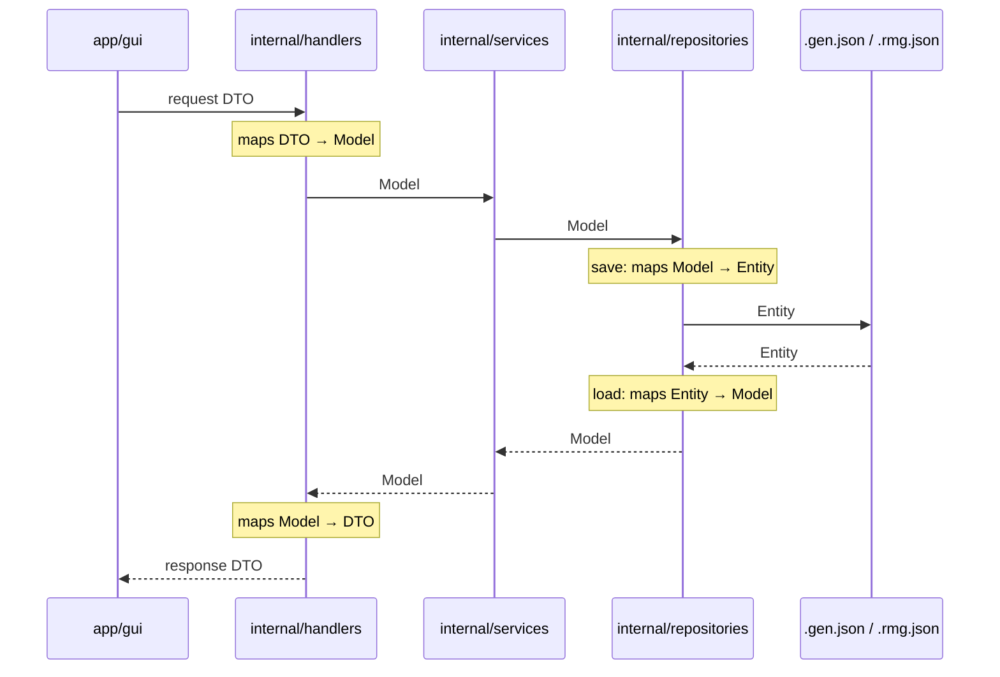
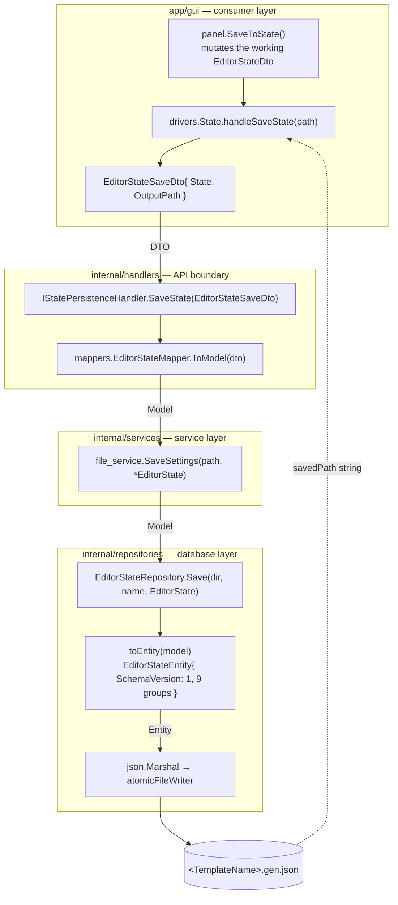
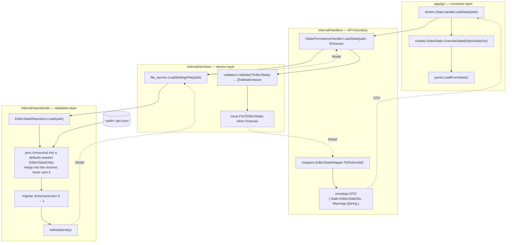
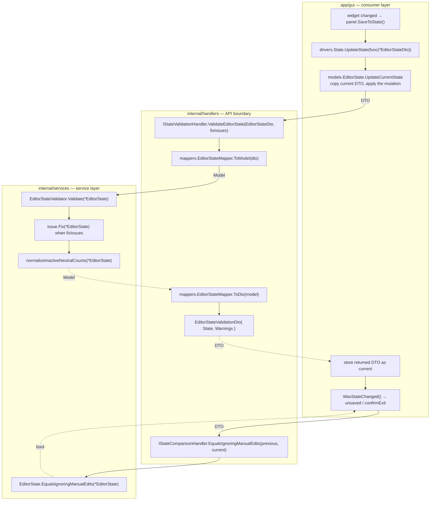

# Batch I — `EditorStateDto` rework (backlog §2.1, folding in §1.5)

Split the 72-field god-DTO into behaviour-free entity groups under a model that
owns its behaviour, make `EditorStateDto` a thin versioned persistence shell,
switch the runtime type from the DTO to the model, and stop the panels
deep-cloning the whole state every frame.

Backlog items closed by this work: [§2.1](../todo/backlog-opus5.md) and
[§1.5](../todo/backlog-opus5.md).

## For Future Agents

> **⚠ Read [§0.4](#04-layering-doctrine--entity--model--dto) first.** On
> 2026-08-22 the owner corrected the premise this plan was built on:
> `EditorStateDto` is **not** the persisted `.gen.json` shape — that is an
> **Entity's** job. §0 rows "DTO shape" and "Wire shape", the whole of Phase 5,
> and Phase 4's grep gate are **superseded**. Phases 1–4 are done and committed
> or unstaged as described, but their *direction* is corrected by
> **Phases 8–12**. Revised order: **8 → 9 → 10 → 11 → 6 → 12 → 7**.

As work proceeds: mark checkboxes `- [x]` as items complete; when a phase is done,
set its status to `Complete` and write its **Phase Summary** (what was done, key
decisions, anything needed to continue with zero context); run the phase's
**Verification Plan** and record the result before moving on. When all phases are
done, fill in **Final Recap** and **Deployment Plan**.

Read [AGENTS.md](../AGENTS.md) first. Hard rules that bite in this batch:
never touch `data/`, `internal/entities/template/` or `internal/registry/`;
never stage and never commit; delete with `Remove-Item`, never `git rm`;
never run a bulk in-place rewrite over the repository; chain PowerShell with `;`,
never `&&`; unit coverage must not drop below **72.5 %** (currently 72.8 %).

---

## 0. Design decisions (settled with the owner 2026-08-21 — do not relitigate)

| Decision | Choice |
| --- | --- |
| How groups attach | **Anonymous embedding** of the 9 entity groups into `EditorStateModel`. Field promotion means `state.MapSize` keeps compiling at ~1,000 call sites, and `encoding/json` flattens anonymous embedded structs for free. |
| json tags | Live on the **entity leaf fields**, same as `internal/entities/template/` already does for `.rmg.json`. |
| Entity behaviour | Entities are **strictly behaviour-free value groups**. All logic lives on the model. Per AGENTS.md §4.6 pure data structs need no unit tests. |
| Runtime type | The **model**, everywhere. `EditorStateDto` appears only at the load/save boundary (`internal/repositories`, `internal/services/file_service`). |
| DTO shape | `EditorStateDto { SchemaVersion int; EditorState editor_state_model.EditorStateModel }` — a **named** field, not embedded. |
| Wire shape | Stays **flat**. `MarshalJSON`/`UnmarshalJSON` on the DTO hoist the model's fields using an internal anonymous-embedding alias, so `schemaVersion` sits as a sibling of the existing 72 keys. |
| `schemaVersion` | Always written as `1`. On load, `0` is normalised to `1` through an explicit migration hook. |
| Entity package | `internal/entities/editor_state/` (package `editor_state`). The owner decided on 2026-08-11 and re-confirmed on 2026-08-21 to put these under `internal/entities/` rather than `internal/models/`. AGENTS.md §4.4 carries this carve-out explicitly since Phase 3 — do not "fix" it. |
| Model package | `internal/models/editor_state_model/` (package `editor_state_model`) — renamed from `editor_state` to avoid a package-name collision with the entities. |
| DTO package | The three `editorState*Dto.go` files move into the existing `internal/dtos/editor_state_dto/`, alongside its current internals. |
| Content defaults | `DefaultPlayerZoneContentRows` and its helpers move to a new `internal/common/common_zone_contents/`, with `Get`/`get` prefixes, mirroring [neutralZoneProfile.go](../internal/common/common_zones/neutralZoneProfile.go). |
| §1.5 | **In scope**, as its own phase, using option 3 (per-panel view structs) in `app/gui/models/`. Acceptance: any measurable allocation improvement, recorded here. |
| Round-trip guard | A committed golden `.gen.json` with every field populated, under `test/test_helpers/testdata/`. |

### 0.1 Field → group map (72 fields, 9 groups)

Verify the count is exactly 72 against
[editorStateDto.go](../internal/dtos/editorStateDto.go#L15-L94) before writing
any struct; a prior automated census reported 76 and was wrong.

| Group (file) | Fields |
| --- | --- |
| `templateIdentity.go` (2) | `TemplateName`, `GameMode` |
| `mapSettings.go` (2) | `MapSize`, `ExperimentalMapSizes` |
| `playerSettings.go` (4) | `PlayerCount`, `HeroCountMin`, `HeroCountMax`, `HeroCountIncrement` |
| `neutralZoneSettings.go` (11) | `NeutralZoneCount`, `SpawnAbandonedOutposts`, `AbandonedOutpostCount`, `NeutralLowestNoCastleCount`, `NeutralLowestCastleCount`, `NeutralLowNoCastleCount`, `NeutralLowCastleCount`, `NeutralMediumNoCastleCount`, `NeutralMediumCastleCount`, `NeutralHighNoCastleCount`, `NeutralHighCastleCount` |
| `castleSettings.go` (10) | `AdvancedMode`, `PlayerOwnedCastles`, `PlayerZoneCastles`, `NeutralZoneCastles`, `HubZoneCastles`, `NeutralLowestCastlesPerZone`, `NeutralLowCastlesPerZone`, `NeutralMediumCastlesPerZone`, `NeutralHighCastlesPerZone`, `MatchPlayerCastleFactions` |
| `generationSettings.go` (15) | `PlayerZoneSize`, `NeutralZoneSize`, `HubZoneSize`, `GuardRandomization`, `Topology`, `RandomPortals`, `MaxPortalConnections`, `SpawnRemoteFootholds`, `RemoteFootholdCount`, `GenerateRoads`, `NoDirectPlayerConn`, `ResourceDensityPercent`, `StructureDensityPercent`, `NeutralStackStrengthPercent`, `BorderGuardStrengthPercent` |
| `gameRuleSettings.go` (16) | `VictoryCondition`, `FactionLawXpPercent`, `AstrologyXpPercent`, `LostStartCity`, `LostStartCityDay`, `LostStartHero`, `CityHold`, `CityHoldDays`, `GladiatorArena`, `GladiatorArenaDaysDelayStart`, `GladiatorArenaCountDay`, `Tournament`, `TournamentFirstTournamentDay`, `TournamentInterval`, `TournamentPointsToWin`, `TournamentSaveArmy` |
| `contentSettings.go` (10) | `BannedItems`, `BannedMagics`, `ValueOverridesText`, `Bonuses`, `PlayerZoneContentRows`, `LowestNeutralContentRows`, `LowNeutralContentRows`, `MediumNeutralContentRows`, `HighNeutralContentRows`, `HubZoneContentRows` |
| `manualEditSettings.go` (2) | `ManualZones`, `ManualConnections` |

Owner rulings folded in: `AdvancedMode` sits with `castleSettings` because it
gates castle diffing; all three zone sizes sit in `generationSettings`; there is
**no** `hubZoneSettings` group — `HubZoneSize` → `generationSettings`,
`HubZoneCastles` → `castleSettings`.

### 0.2 Phase ordering rationale

The build stays green at every phase boundary. Phase 3 has the DTO embed the
model **anonymously and temporarily**, so field promotion survives and no
consumer's *field accesses* change; its promoted **methods** do change shape,
which is why Phase 3 also keeps DTO-signature shims (hazard 1). Only after
Phase 4 moves every consumer onto the model does Phase 5 give the DTO its named
field, at which point nothing reads DTO fields any more.

### 0.3 Known hazards

Items 1–6 were found by an independent review of this plan's first draft and
had each falsified something it originally claimed. Treat them as load-bearing.

1. **Promoted methods change signatures, so Phase 3 needs shims.** With the model
   embedded, `dto.Clone()` resolves to the model's method and returns an
   `EditorStateModel`, and `EqualsIgnoringManualEdits`/`LayoutDefiningOptionsChanged`/
   `DiffCastleSettings` start demanding `*EditorStateModel`. Today's callers assign
   the clone to a DTO and pass DTO pointers —
   [editorState.go](../app/gui/models/editorState.go#L26) and
   [regenerationDecisionService.go](../internal/services/editor/regenerationDecisionService.go#L29).
   Phase 3 must therefore keep **explicit DTO-signature shim methods** that shadow
   the promoted ones and delegate inward; Phase 4 deletes them.
2. **`omitempty` already conflates nil and empty — do not "restore" a
   distinction that was never persisted.** All six content-row slices and both
   manual-edit slices carry `omitempty`
   ([editorStateDto.go](../internal/dtos/editorStateDto.go#L85-L94)), so nil and
   `[]` both serialise to an absent key, and an absent key then keeps whatever
   `NewDefaultEditorStateDto` seeded. `EqualsIgnoringManualEdits` distinguishes
   nil from empty **in memory only**. Batch I must preserve this behaviour
   exactly and characterise it in a test — it must not try to make the
   distinction survive the file.
3. **JSON key order will change, so byte-diffing is not a valid gate.**
   `encoding/json` emits fields in declaration/embedding order, and regrouping
   reorders them. The format stays flat with the same key set; only the textual
   order moves. Every round-trip assertion must compare **parsed objects**, never
   bytes. `.gen.json` is only ever read by `json.Unmarshal`, so the reordering is
   cosmetic — but the owner's existing files will be rewritten in the new order
   on their next save.
4. **Phase 1 is not a pure package-clause move.**
   [editorStateDto.go](../internal/dtos/editorStateDto.go#L4) imports
   `editor_state_dto` and qualifies `editor_state_dto.ManualZoneSave` /
   `CastleSettingChanges`; once it lives *in* that package those qualifiers must
   be stripped. Four sibling DTOs in the parent package also embed or carry
   `EditorStateDto` and need the new import —
   [regenerationDecisionRequestDto.go](../internal/dtos/regenerationDecisionRequestDto.go#L13),
   [templateUpdateDto.go](../internal/dtos/templateUpdateDto.go#L13),
   [castleSettingsReapplyRequestDto.go](../internal/dtos/castleSettingsReapplyRequestDto.go#L11)
   and `manualEditDecisionDto.go`.
5. **Carrier DTOs are part of the runtime swap.** Those same four, plus
   `EditorStateSaveDto` and `EditorStateValidationDto`, hold editor state inside
   another DTO. Phase 4 changes what they carry; it is not only an interface
   signature change. `stateHandler` forwards the very value that `file_service`
   persists ([stateHandler.go](../internal/handlers/stateHandler.go#L27)), so the
   model→DTO wrap on save and DTO→model unwrap on load need a named owner.
6. **The two reflection guards need *different* treatment.**
   [clone_test.go](../test/unit/internal/dtos/editorStateDto/clone_test.go#L120-L132)
   already walks recursively through `assertNoSharedStorage` and keeps working
   unchanged. [equalsIgnoringManualEdits_test.go](../test/unit/internal/dtos/editorStateDto/equalsIgnoringManualEdits_test.go#L211-L230)
   enumerates **top-level fields only** and mutates them by index — after
   grouping it will fail loudly on a struct kind rather than fail silently. It
   must be rewritten to enumerate recursive leaf paths, ignore only the two
   manual-edit leaves, exclude `SchemaVersion`, and mutate the model rather than
   the DTO shell.
7. ~~**Named literal.**~~ **Falsified in Phase 3.** The plan expected
   `NewDefaultEditorStateDto`'s ~32 named fields to become a nested literal. Go
   1.27 accepts **promoted fields as composite-literal keys**, so the literal
   stays flat — and `modernize`'s `embedlit` rule rewrites the nested form back
   to the flat one, so flat is also what the linter demands. Eliding only the
   type (`Group: {…}`) is invalid Go.
8. **Load seeds defaults.** [editorStateRepository.go](../internal/repositories/editorStateRepository.go#L26-L29)
   unmarshals *over* `NewDefaultEditorStateDto()`, which is how absent keys keep
   their defaults. `UnmarshalJSON` in Phase 5 must preserve that merge semantic —
   it must not zero the receiver first.
9. **`MarshalJSON` recursion.** The alias type inside `MarshalJSON` must be a
   locally declared type that embeds the model — not the DTO — or the marshaller
   calls itself forever.
10. **Import cycle — the shared types cannot stay in `editor_state_dto`.**
    Found while starting Phase 2; the plan's first draft missed it entirely.
    `ManualZoneSave`, `ManualConnectionSave` and `CastleSettingChanges` live in
    `internal/dtos/editor_state_dto/`, but Phase 2's `manualEditSettings.go`
    must hold the first two and Phase 3's model must return the third. Combined
    with the settled DTO shape (`editor_state_dto` → `editor_state_model`) and
    the model → entities edge, that closes a cycle:

    ```
    editor_state_dto ──embeds──▶ editor_state_model ──embeds──▶ entities/editor_state
           ▲                                                             │
           └──────────── ManualZoneSave / CastleSettingChanges ◀─────────┘
    ```

    Only the third edge is removable, so those three types **must** move out.
    **Owner ruling (2026-08-21):** split them by behaviour.
    - The two pure structs (fields + json tags only, no methods) go to
      `internal/entities/editor_state/`, keeping entities behaviour-free per §0.
    - `CastleSettingChanges` (it has `Any()`) and two wrapper models embedding
      the pure structs — `ManualZoneSaveModel`, `ManualConnectionSaveModel`,
      carrying `Clone()` — go to `internal/models/editor_state_model/`.
    - The four `To…`/`From…` converters keep returning the **entity** slice, so
      no assignment site needs an unwrap loop. The six private deep-clone
      helpers for `entities.Zone`/`entities.Connection` stay private in
      `editor_state_model`.

    This runs as **Phase 2 step 0**, before the group extraction, and partly
    undoes Phase 1's consolidation — that is expected, not a regression.
    `internal/entities` must remain the base layer: it imports nothing from
    `models`, `dtos` or `helpers`, and `entities/editor_state` must not either.

---

## 0.4 Layering doctrine — Entity / Model / DTO

**Owner ruling, 2026-08-22. This supersedes any contrary statement earlier in
this plan.** It is the standard enterprise three-layer split used in C# and Java
projects; see [Baeldung — Entities vs DTOs](https://www.baeldung.com/java-entity-vs-dto)
and [DevsDaily — Entity, Model, ViewModel and DTO in C#](https://devsdaily.com/understanding-entity-model-viewmodel-and-dto-in-csharp/).

| Layer | Type | Declared in | May be used by | Logic |
| --- | --- | --- | --- | --- |
| **Database** | Entity | `internal/entities/` | `internal/repositories/` only | none beyond (de)serialisation — i.e. json tags |
| **Service** | Model | `internal/models/` | `internal/services/`, `internal/validators/`, `internal/mappers/`, `internal/repositories/` | **all business logic lives here** |
| **Consumer** | DTO | `internal/dtos/` | `internal/handlers/`, and in `app/` **only at handler call sites** | none |

The rules, stated exactly:

- An **Entity** is literally the boundary to external storage — files on disk,
  rows in a database. It has no logic beyond serialising to and from its storage
  format (here, JSON).
- An Entity **may be embedded in, or held as a field of, a Model**. In that case
  it is the *Model* that is being used, not the Entity, and that is allowed. An
  Entity must never be passed around by itself above the repository.
- A **Model** carries the business logic, is used in services, and **never leaves
  the backend**. `app/` must not see a Model.
- A **DTO** is the contract between the frontend (`app/gui/`) and the backend
  (`internal/`). It has no innate logic and exists only to cross the API
  boundary — which, in this project, is `internal/handlers/`. A DTO in
  `internal/` may therefore be used **only** in `internal/handlers/`, and in
  `app/` only at the handler call site.
- **Dependency direction is DTO → Model → Entity and never the reverse.** An
  Entity that imports `internal/models` is a defect, not a shortcut.

### 0.4.1 Request/response flow

The consuming UI creates a **request DTO**; each layer converts it down, and the
answer travels back up. Conversion happens at exactly two seams — the handler
(DTO ⇄ Model) and the repository (Model ⇄ Entity).



- **Save.** The GUI builds a request DTO → the handler maps it to a Model → the
  service works on the Model → the repository maps the Model to an Entity and
  writes it.
- **Load.** The repository reads an Entity and **returns a Model** to the service
  → the service returns the Model to the handler → the handler maps it to a
  response DTO → the GUI renders the DTO.

### 0.4.2 What this batch got wrong

Phases 1–4 were built on the premise that `EditorStateDto` is the persisted
`.gen.json` shape. **It is not, and was never meant to be** — that is an Entity's
job, and correcting it is the whole point of the rework. Four concrete defects
follow from the mistake:

1. **The persisted shape is a DTO.** `internal/repositories/editorStateRepository.go`
   is typed `IFileRepository[editor_state_dto.EditorStateDto]`, so the storage
   boundary speaks the consumer type. §0's "DTO shape" and "Wire shape" rows and
   the whole of **Phase 5** are built on this and are superseded.
2. **Phase 4 pushed `app/` onto the Model.** It is backwards: the GUI must hold
   the DTO. Phase 4's own grep gate ("`EditorStateDto` only in
   `editor_state_dto`, `repositories`, `file_service`") encodes the inverted
   rule and must be replaced by the §0.4 table.
3. **The dependency arrow is reversed in the entity layer.**
   [contentSettings.go](../internal/entities/editor_state/contentSettings.go)
   imports `internal/models` and `internal/models/config`;
   [generationSettings.go](../internal/entities/editor_state/generationSettings.go)
   imports `internal/models/config`. Entities depend on Models today.
4. **AGENTS.md §4.4 contradicts the doctrine.** It currently permits packages
   outside `internal/` to use `internal/models/` and `internal/entities/` for
   "data typing". Under §0.4 only `internal/dtos/` is permitted there.

**Scope note — the breach is repository-wide, not Batch I's alone.** 36 files
under `app/` import `internal/models` or `internal/entities` (Phase 4 added 8 of
them; the other 28 predate this batch). Fixing all of them is a separate batch.
Phases 8–12 below correct **editor state** and put a mechanical guard in place;
the rest is recorded as a backlog item in Phase 12.

### 0.4.3 Editor-state flows in the target state (after Phases 8–12)

These are the concrete shapes of §0.4.1 for editor state, as they must look once
the correction phases are done. Solid arrows are the request path, dotted arrows
the response path; the label on each arrow is **the type that crosses it**.

Invariants visible in all three — use them as the review checklist:

- There are exactly **two conversion seams**: `internal/handlers` (DTO ⇄ Model)
  and `internal/repositories` (Model ⇄ Entity). Nowhere else converts.
- `app/` never names a Model or an Entity. `internal/repositories` never names a
  DTO. `internal/services` and `internal/validators` never name a DTO.
- The Entity exists only inside the repository; it never crosses that subgraph's
  border.

#### Save



#### Load



#### Update (a single edited setting)

Runs on the frame path, so it is the flow most sensitive to the Phase 11
decision — see the note under the diagram.



Notes on the update flow, all of which are **open until the owner answers Phase
11's decision**:

- `H5` / `M1` are drawn as a handler round trip because
  `EqualsIgnoringManualEdits` is Model logic and `app/` may not call it directly.
  The same applies to `LayoutDefiningOptionsChanged`, `DiffCastleSettings` and
  `HasManualEdits`. `IStateComparisonHandler` is an **invented name** — no such
  interface exists yet.
- The "copy current DTO" step in `A3` is drawn as staying inside `app/`. That is
  Phase 11 option (b): copying a logic-free struct is view-layer plumbing, not
  business logic. Under option (a) it becomes another handler call and the
  diagram gains a second round trip per edit.
- Every arrow crossing the `app` ⇄ `handlers` border on this path costs a
  DTO ⇄ Model conversion **per frame**, which is exactly what Phase 6 is trying
  to reduce. Phase 11 must be decided with Phase 6's benchmark in view, not
  separately.

---

## Phase 1: Baseline guard + DTO package move
Status: Complete   <!-- Not started | In progress | Complete -->

Freeze today's on-disk format as a committed artefact **before any code changes**,
then perform the pure package move on its own so the noisy import diff never
mixes with a behaviour change.

- [x] Confirm the field count is exactly 72 and record any discrepancy here.
      **72 confirmed, no discrepancy** — counted by hand on
      [editorStateDto.go](../internal/dtos/editorStateDto.go) (24 + 36 + 4 + 6 + 2)
      and re-confirmed mechanically by the fixture's top-level key count assertion.
- [x] Record the **before** coverage number (AGENTS.md §2.3) so every later phase
      has a baseline to compare against. **Baseline = 73.6 %** on a clean tree.
      This supersedes the 72.8 % quoted in the carry-forward (the Go 1.27 batch
      raised it); the 72.5 % floor still governs.
- [x] Write a throwaway program (or a temporary test) that builds an
      `EditorStateDto` with **every** field set to a distinctive non-zero value,
      including all six content-row slices, bonuses, manual zones and manual
      connections, and marshal it with the **current** code.
      Builder kept permanently as
      [allFieldsEditorState.go](../test/test_helpers/allFieldsEditorState.go)
      (`NewAllFieldsEditorStateDto`); the throwaway `cmd/tmpfixturegen` generator
      wrote the fixture through the **real** `EditorStateRepository.Save` and was
      then deleted.
- [x] Add the result as `test/test_helpers/testdata/editorState_v0_flat.gen.json`
      — a new **unstaged** file; do not stage it and do not commit it. Name it
      `_v0_` because it has no `schemaVersion`: it is the legacy-shape fixture
      that Phase 5's migration hook must keep loading.
- [x] Add a golden round-trip test that loads the fixture and asserts every one of
      the 72 fields survives with its distinctive value. Compare **parsed values,
      never bytes** (hazard 3). This test must stay green, unchanged in intent,
      through every later phase.
      Added as
      [editorStateWireFormat_integration_test.go](../test/integration/editorStateWireFormat_integration_test.go)
      — **untagged** (production APIs only, no `*_testexports.go`, no GPU), so it
      runs in a plain `go test ./test/...`. Three gates: fixture unmarshals into a
      **zero** DTO and equals the builder; the fixture has exactly 72 top-level
      keys; marshalling the builder equals the fixture **as parsed maps**.
- [x] Move [editorStateDto.go](../internal/dtos/editorStateDto.go),
      [editorStateSaveDto.go](../internal/dtos/editorStateSaveDto.go) and
      [editorStateValidationDto.go](../internal/dtos/editorStateValidationDto.go)
      into `internal/dtos/editor_state_dto/`.
- [x] Strip the now-invalid self-qualifiers inside the moved file
      (`editor_state_dto.ManualZoneSave` → `ManualZoneSave`, likewise
      `CastleSettingChanges`) and drop the self-import (hazard 4).
      Four sites, exactly as surveyed.
- [x] Add the new import to the **three** sibling DTOs left in `internal/dtos/`
      that carry editor state: `regenerationDecisionRequestDto.go`,
      `templateUpdateDto.go`, `castleSettingsReapplyRequestDto.go`.
      **Plan correction:** `manualEditDecisionDto.go` needs **no** change — it
      only references `*editor_state_dto.CastleSettingChanges` and already
      imports that package. §0.3 hazard 4 lists it in error. The compiler
      confirmed this: after the move it reported exactly these three files.
- [x] Update imports and qualifiers (`dtos.EditorStateDto` →
      `editor_state_dto.EditorStateDto`) across the 12 production packages and the
      test tree. Do this file by file — **no bulk in-place rewrite** (AGENTS.md §2.6).
      **104 files, 509 sites.** Owner approved the mechanism: substitution of the
      five fixed, unambiguous tokens over an **explicit enumerated file list**
      (§2.6's own "explicit list from `gofmt -l`" pattern), never a repo-wide sweep.
- [x] Move the mirrored unit-test folders to
      `test/unit/internal/dtos/editor_state_dto/…` per AGENTS.md §4.6.
      `test/unit/internal/dtos/editorStateDto/` →
      `test/unit/internal/dtos/editor_state_dto/editorStateDto/` (7 files).

### Verification Plan
- `go build ./...` clean; `go vet ./...` and
  `go vet -tags='integration_test,gui' ./...` clean.
- `go run ./cmd/testlayoutcheck .` prints `test-layout check passed`.
- `go test ./test/unit/... -count=1` and
  `go test -tags=integration_test ./test/integration/... -count=1` pass.
- The new golden test passes.
- Coverage report re-run; total ≥ the number recorded above and ≥ 72.5 %.
- Diff review: apart from the fixture and its test, every change must be an
  import, a package clause, a qualifier, or the self-qualifier strip — **no
  behaviour change**.

### Phase Summary
**Complete.** All verification gates green:

| Gate | Result |
| --- | --- |
| `go build ./...` | clean |
| `go vet ./...` / `go vet -tags='integration_test,gui' ./...` | clean |
| `go run ./cmd/testlayoutcheck .` | `test-layout check passed` |
| `go test ./test/... -count=1` (untagged, incl. the new golden test) | exit 0 |
| `go test -tags=integration_test ./test/integration/... -count=1` | exit 0 |
| `go test ./test/unit/... -count=1` | exit 0, 164 packages |
| Coverage | **73.7 %** (baseline 73.6 %, floor 72.5 %) |
| `gofmt -l .` | empty |
| `golangci-lint-v2 run ./...` | 50 issues, **all pre-existing `funcorder`**; down from 71 |

What exists now:

- `internal/dtos/editor_state_dto/` owns `editorStateDto.go`, `editorStateSaveDto.go`
  and `editorStateValidationDto.go` alongside the three types that were already
  there. `internal/dtos/` keeps only the carrier DTOs, which now qualify.
- The wire format is frozen by
  [editorState_v0_flat.gen.json](../test/test_helpers/testdata/editorState_v0_flat.gen.json),
  written through the **real** `EditorStateRepository.Save`, and guarded by three
  untagged tests in
  [editorStateWireFormat_integration_test.go](../test/integration/editorStateWireFormat_integration_test.go).
  The builder [allFieldsEditorState.go](../test/test_helpers/allFieldsEditorState.go)
  is permanent — Phase 5 regenerates the `_v1_` fixture from the same builder.

Decisions and gotchas for whoever picks this up:

- **The golden test is untagged on purpose.** It touches production APIs only, so
  it runs in a plain `go test ./test/...`. Do not add `integration_test` to it.
- **Zero-value unmarshal is deliberate.** The fixture is loaded into a *zero*
  `EditorStateDto`, not over `NewDefaultEditorStateDto()`. That is what proves the
  file alone carries all 72 values; loading over defaults would let a dropped
  field pass by inheriting its default. Do not "fix" this to match
  `editorStateRepository.Load`.
- **Every bool in the fixture is `true`** for the same reason — a `false` would
  pass vacuously against a zero struct.
- **Comparisons are parsed objects, never bytes** (hazard 3), so Phase 2–3
  regrouping may reorder keys freely without touching this test.
- The 72-key count is now asserted mechanically, so Phase 2's field→group split
  cannot silently lose or add a key.
- Three files — [state.go](../app/gui/drivers/state.go),
  [editorState.go](../app/gui/models/editorState.go),
  [layoutPanelZones.go](../app/gui/panels/layoutPanelZones.go) — carry extra
  reflow in the diff. They were **already** non-`gofmt`-clean at HEAD (single-line
  function bodies), and the longer `editor_state_dto.` qualifier pushed those
  lines past the `golines` limit, so a reflow was unavoidable. It was applied by
  the project's own *"Go: Run Linter"* `--fix` task, not by an ad-hoc `gofmt -w`.
- `coverage.txt`, `coverage.html` and `lcov.info` are regenerated tracked
  artefacts, expected in the diff.
- Nothing is staged. Nothing is committed.

---

## Phase 2: Extract the entity groups
Status: Complete

- [x] **Step 0 — break the import cycle (hazard 10).** Move `ManualZoneSave` and
      `ManualConnectionSave` (pure structs) to `internal/entities/editor_state/`;
      move `CastleSettingChanges`, the two wrapper models and the four converters
      to `internal/models/editor_state_model/`. Update consumers and move the
      three mirrored unit-test folders. Must land before the groups are written.
- [x] Create `internal/entities/editor_state/` with the 9 files from §0.1, one
      struct per file, camelCase file names (AGENTS.md §4.1).
- [x] Move each field **with its existing json tag verbatim**. Do not rename, do
      not reorder within a group, do not change a type.
- [x] Create `internal/common/common_zone_contents/` and move
      `DefaultPlayerZoneContentRows` → `GetDefaultPlayerZoneContentRows`, with the
      four private helpers renamed to a `get` prefix.
- [x] Move its unit test to the mirrored
      `test/unit/internal/common/common_zone_contents/…` folder.
- [x] Leave `EditorStateDto` untouched this phase — the entities exist but nothing
      uses them yet, so the phase is purely additive.

### Verification Plan
- `go build ./...` clean, full unit + integration suites pass unchanged.
- `go run ./cmd/testlayoutcheck .` passes.
- Manual check: the 9 structs together declare exactly 72 tagged fields, and the
  tag set is byte-identical to the DTO's.
- Coverage ≥ 72.5 % and not below the Phase 1 baseline.
- **Owner gate:** the §0.1 field→group table is signed off before Phase 3 starts.

### Phase Summary

**Step 0 — the import cycle (hazard 10).** Writing the groups would have closed
`editor_state_dto → editor_state_model → entities/editor_state → editor_state_dto`.
The first edge is a settled §0 decision and the second is the point of the batch,
so only the third was removable. Owner ruling: behaviour-free structs
(`ManualZoneSave`, `ManualConnectionSave`) go to `internal/entities/editor_state/`;
`CastleSettingChanges`, the two wrapper models (`ManualZoneSaveModel`,
`ManualConnectionSaveModel`, anonymous embeds with `Clone()`) and the four
converters go to `internal/models/editor_state_model/`. Converters return the
**entity** slice; the six deep-clone helpers stay **private** in
`editor_state_model`. This partly undoes Phase 1's consolidation, and it makes the
layering rule load-bearing: **`internal/entities` must import nothing from
`models`/`dtos`/`helpers`.**

**Groups.** `internal/entities/editor_state/` now holds the 9 structs from §0.1
(`templateIdentity` 2, `mapSettings` 2, `playerSettings` 4, `neutralZoneSettings`
11, `castleSettings` 10, `generationSettings` 15, `gameRuleSettings` 16,
`contentSettings` 10, `manualEditSettings` 2) — **72 tagged fields**, every tag
verbatim.

**Tag verification.** The plan called for comparing the tag set against the DTO at
HEAD, but Phase 1 is now committed (`586fc18 "Batch I wip"`) and that path no
longer exists. Compared instead against the frozen wire-format fixture
`test/test_helpers/testdata/editorState_v0_flat.gen.json` — a stronger check:
entity tag count 72, fixture key count 72, sets equal, 0 duplicates.

**Content rows.** `GetDefaultPlayerZoneContentRows` (+ four `get`-prefixed private
helpers and `const guardedRuleName`) moved to
`internal/common/common_zone_contents/`; both callers (`editorStateDto.go`,
`app/gui/dialogs/zoneContentDialog.go`) updated; the unit test moved to the
mirrored folder. `editorStateDto.go` net `14 +/112 -`.

**Gates.** `go build` clean; `go vet -tags='integration_test,gui'` clean;
`gofmt -l .` empty; `testlayoutcheck` passed; unit, default (frozen golden test
included) and tagged-integration suites all exit 0 — re-run after the lint pass.
Coverage **73.6 %** (floor 72.5 %). Lint `--fix` took 85 issues → **21, all
pre-existing `funcorder`**; `git status --short` counts were identical before and
after, confirming no drive-by files. Overall diff: 32 files, +85/−1007.

**Gotchas worth remembering.** (a) `embedlit`/modernize collapses
`Model{Embedded: X{...}}` to `Model{{...}}`, which orphaned the
`entities/editor_state` import in both `clone_test.go` files. (b) PowerShell
`-replace '…' , '$1' + $type` parses `$1ManualZoneSave` as a *group name*, so the
replacement silently no-ops — use a separate blanket pass. (c) The plan's hazard 4
is also inaccurate: it lists `manualEditDecisionDto.go` as a Phase 1 change that
was never needed.

**Next:** Phase 3 is blocked on the owner gate — the §0.1 field→group table must be
signed off first.

---

## Phase 3: Introduce the model, DTO delegates
Status: Complete

- [x] Create `internal/models/editor_state_model/editorStateModel.go` —
      `EditorStateModel` anonymously embedding the 9 entity structs.
- [x] Move the behaviour onto it: `Clone`, `LayoutDefiningOptionsChanged`,
      `DiffCastleSettings`, `EqualsIgnoringManualEdits`, `HasManualEdits`, the
      private comparison helpers, and a `NewDefaultEditorStateModel` factory
      carrying the current defaults.
- [x] Reduce `EditorStateDto` to `struct { editor_state_model.EditorStateModel }`
      — **anonymous, temporarily** — so every `state.MapSize` selector and the flat
      json output are unchanged and the whole repository still compiles untouched.
- [x] Keep **DTO-signature shim methods** on the DTO that shadow the promoted
      ones (hazard 1): `Clone() EditorStateDto`,
      `EqualsIgnoringManualEdits(*EditorStateDto) bool`,
      `LayoutDefiningOptionsChanged(*EditorStateDto) bool`,
      `DiffCastleSettings(*EditorStateDto) CastleSettingChanges`. Each delegates
      to the embedded model. Without these, Phase 3 does **not** build.
- [x] `NewDefaultEditorStateDto` delegates to `NewDefaultEditorStateModel`.
- [x] Move the DTO behaviour tests to
      `test/unit/internal/models/editor_state_model/editorStateModel/<method>_test.go`,
      one file per public method (AGENTS.md §4.6).
- [x] Leave the recursive clone guard alone; rewrite the equality guard to walk
      recursive **leaf paths** instead of top-level fields (hazard 6), and add a
      case proving it still trips when a field is added to a nested group but
      omitted from the comparison.

### Verification Plan
- `go build ./...` clean; full unit + integration suites pass **with no test
  changes other than the moves and the equality guard rewrite**.
- Phase 1's golden test passes untouched — this is the proof the key set is
  intact. Expect the key **order** to change; that is allowed (hazard 3).
- Coverage ≥ 72.5 % and not below the Phase 1 baseline.

### Phase Summary

**Complete.** The owner signed off the §0.1 field→group table before this phase
started, as the Phase 2 gate required.

What exists now:

- [editorStateModel.go](../internal/models/editor_state_model/editorStateModel.go)
  holds `EditorStateModel` — the nine entity groups embedded anonymously — plus
  every method that used to live on the DTO (`NewDefaultEditorStateModel`,
  `Clone`, `LayoutDefiningOptionsChanged`, `DiffCastleSettings`,
  `EqualsIgnoringManualEdits`, `HasManualEdits`, the three scalar-comparison
  helpers and the content-row/pointer helpers). Bodies were moved **verbatim**;
  only the receiver and parameter types changed.
- [editorStateDto.go](../internal/dtos/editor_state_dto/editorStateDto.go) is now
  41 lines: the embedded model, `NewDefaultEditorStateDto` delegating to
  `NewDefaultEditorStateModel`, and the four DTO-signature shims. `HasManualEdits`
  needs no shim — its signature does not mention the state type, so the promoted
  method is used as-is.

**Hazard 7 is obsolete on Go 1.27 — and the linter enforces the flat form.**
The plan assumed `NewDefaultEditorStateDto` would have to become a *nested*
literal. Go 1.27 accepts **promoted fields as keys in a composite literal**, so
`EditorStateModel{TemplateName: …, MapSize: …}` compiles unchanged, and
`modernize`'s `embedlit` rule actively rewrites the nested form back to the flat
one. Both `NewDefaultEditorStateModel` and
[allFieldsEditorState.go](../test/test_helpers/allFieldsEditorState.go) therefore
kept their original flat literals. Note the inverse trap: `Group: {…}` (eliding
only the type) is **not** valid Go and does not compile — it is either the full
`Group: pkg.Group{…}` or the flat promoted keys.

**Test moves.** The five behaviour test files moved to
`test/unit/internal/models/editor_state_model/editorStateModel/`, with
`newDefaultEditorStateDto_test.go` renamed to `newDefaultEditorStateModel_test.go`.
The DTO folder was repopulated with **thin delegation tests** for the four shims
and the factory, so §4.6's one-file-per-public-method rule still holds while the
shims exist; Phase 4 deletes both the shims and those files.

**Equality drift guard (hazard 6), as rewritten.** It now enumerates recursive
**leaf paths** (`"MapSettings.MapSize"`), descending only through *anonymous*
fields, and mutates through `FieldByIndex`. `SchemaVersion` needs no exclusion:
the guard walks the model, and Phase 5 puts the version on the DTO shell. The
"proof it still trips" case is
`TestWhenTheLeafWalkIsBuilt_ReachesEveryFieldOfEveryGroup`, a single
`assert.Equal` on a group→field-count map — it fails both when the walk stops at
a group (nested fields unreached, so an uncompared one could hide) and when any
group gains or loses a field. It is the §0.1 table asserted mechanically.

**Unexpected side effect worth knowing.** Two `//nolint:govet` directives in
[getCurrentState_test.go](../test/unit/app/gui/models/editorState/getCurrentState_test.go)
became *unused* and were removed: `govet`'s `unusedwrite` analyzer no longer
fires on `copyOfState.TemplateName = …` now that the field is promoted through
two levels of embedding.

**Gates.**

| Gate | Result |
| --- | --- |
| `go build ./...` | exit 0 |
| `go vet ./...` / `go vet -tags='integration_test,gui' ./...` | exit 0 |
| `go run ./cmd/testlayoutcheck .` | `test-layout check passed` |
| `go test -count=1 ./test/unit/...` | exit 0 |
| `go test -count=1 ./test/...` (incl. the frozen golden test, untouched) | exit 0 |
| `go test -tags=integration_test -count=1 ./test/integration/...` | exit 0 |
| Coverage | **73.7 %** (Phase 1 baseline 73.6 %, floor 72.5 %) |
| `gofmt -l .` | empty |
| `golangci-lint-v2 run ./...` | **0 issues** |

The GPU suite was not run: no rendering code changed. Phase 4's plan requires it.
Nothing was staged and nothing was committed.

**Also amended:** AGENTS.md §4.4 now carries the editor-state carve-out
explicitly (open question 2 from the carry-forward), so the
`internal/entities/editor_state/` placement no longer contradicts the table.

---

## Phase 4: Swap the runtime type to the model
Status: Complete

Pure type-name substitution. Because fields stay promoted, **no field-access site
changes** — only signatures and variable types.

**Owner rulings (2026-08-22), settled before the phase started:**

- `EditorStateSaveDto` and `EditorStateValidationDto` **stay in
  `internal/dtos/editor_state_dto/`**. The package is not "the persistence
  shell" — it is the DTO package for `EditorState(Model)` operations (load,
  save, validate). Only their `State` field type changes. Do not propose moving
  them to `internal/dtos/` again.
- The model↔DTO conversion gets a **named API** on the DTO:
  `NewEditorStateDto(model)` and `(*EditorStateDto).Model()`. `file_service`
  calls those, so Phase 5's reshape to a named field rewrites those two bodies
  and nothing else. This is hazard 5's "named owner".

**Plan correction:** `ManualEditDecisionDto` needs **no** change. Phase 2 moved
`CastleSettingChanges` to `editor_state_model`, so it already carries no editor
state. The carrier list below is over-inclusive by one — the same class of error
as §0.3 hazard 4's `manualEditDecisionDto.go` entry.

- [x] `app/gui/models.EditorState`: `current`/`previous`/`next` become
      `*editor_state_model.EditorStateModel`; update `GetCurrentState`,
      `OverrideState`, `SetNextState`, `UpdateCurrentState`, `GetPreviousState`,
      `GetNextState`.
- [x] `internal/handlers/handler_interfaces`: `IStateValidationHandler` and the
      other DTO-carrying signatures take/return the model.
- [x] `internal/validators`: `ValidationIssue.Fix(*EditorStateModel)`; the 45
      validated fields and 46 issue categories are unchanged.
- [x] `internal/mappers/generatorConfigMapper.go`: `FromEditorState` takes the
      model. All 69 field reads stay as written.
- [x] `app/gui/drivers`, `app/gui/editor`, `app/gui/panels`,
      `internal/services/editor`: update the types they pass through.
- [x] `internal/repositories` and `internal/services/file_service` keep the
      **DTO** — they are the load/save boundary. Name the owner of the conversion
      explicitly: `file_service` wraps model→DTO on save and unwraps DTO→model on
      load, and nothing above it sees a DTO (hazard 5).
- [x] Convert the **carrier DTOs** that hold editor state inside another DTO to
      carry the model: `EditorStateSaveDto`, `EditorStateValidationDto`,
      `RegenerationDecisionRequestDto`, `TemplateUpdateDto`,
      `CastleSettingsReapplyRequestDto`, ~~`ManualEditDecisionDto`~~. This is the
      item most likely to be under-estimated — it is not just interface signatures.
- [x] Delete the Phase 3 shim methods once every caller is on the model.
- [x] Update every mock under [test/test_helpers](../test/test_helpers) and the
      affected unit/integration tests.

### Verification Plan
- `go build ./...`, both `go vet` variants, `testlayoutcheck` all clean.
- Full unit + integration suites pass.
- `go test -tags='integration_test,gui' ./test/integration/gui/... -count=1`
  passes **without `-update`** — the GPU suite proves the GUI still behaves.
- Phase 1's golden test still passes.
- Round-trip non-aliasing test: load a file, mutate the returned model, reload,
  assert the second read is unaffected.
- `grep` check: `EditorStateDto` appears only in `internal/dtos/editor_state_dto`,
  `internal/repositories` and `internal/services/file_service`.
- Coverage ≥ 72.5 % and not below the Phase 1 baseline.

### Phase Summary

**Complete.** 99 files, **+530/−628** — the phase is net-negative because the four
Phase 3 shims and their five delegation tests went away.

**The boundary now has a name.** `file_service` is the only thing that converts:
[fileService.go](../internal/services/file_service/fileService.go) unwraps with
`dto.Model()` on load and wraps with `editor_state_dto.NewEditorStateDto(*model)`
on save. Both helpers live in
[editorStateDto.go](../internal/dtos/editor_state_dto/editorStateDto.go) and are
the *only* two places that know how the DTO stores the model, so Phase 5's
reshape to a named field rewrites those two bodies and nothing else.
`IFileService` is model-facing on both methods; `repositories` still speaks
`IFileRepository[EditorStateDto]`.

**Grep gate passes.** `EditorStateDto` now appears in production code only in
`internal/dtos/editor_state_dto` (8), `internal/repositories` (6) and
`internal/services/file_service` (3). One stale comment in
[zoneContentRowSave.go](../internal/models/zoneContentRowSave.go) was retargeted
at `EditorStateModel`; it was the only other hit.

**Two plan items were wrong and are corrected above.** `ManualEditDecisionDto`
needed no change — Phase 2 had already moved `CastleSettingChanges` to
`editor_state_model`, so it carries no editor state. And the owner ruled that
`EditorStateSaveDto` / `EditorStateValidationDto` **stay** in `editor_state_dto`:
they are the DTOs for `EditorState(Model)` *operations*, not for the persisted
object, so the package is not "the persistence shell" and must not be treated as
one.

**Mechanism.** The type swap was a substitution of two fixed, unambiguous tokens
(`editor_state_dto.EditorStateDto` → `editor_state_model.EditorStateModel`,
`…NewDefaultEditorStateDto` → `…NewDefaultEditorStateModel`) over an **explicit
enumerated file list** — the same owner-approved mechanism as Phase 1, never a
repo-wide sweep. Five paths were deliberately **excluded** because they must keep
the DTO: `test_helpers/allFieldsEditorState.go`,
`test/integration/editorStateWireFormat_integration_test.go`,
`test/unit/…/editorStateRepository/`, `test/unit/…/editorStateDto/` and
`test/unit/…/fileService/`. The last of those is genuinely **mixed** — the
repository mock is typed on the DTO while the service API is model-facing — and
was rewritten by hand.

**New tests.**
[editorStateRoundTrip_integration_test.go](../test/integration/editorStateRoundTrip_integration_test.go)
is the non-aliasing gate the verification plan asked for: save through the real
`InitializeGuiHandler()` graph, then prove that mutating a returned model
(scalar *and* slice element) leaves a reload untouched, that mutating the source
model after a save does not reach the file, and that a full round-trip returns
the all-fields model unchanged. It is **untagged** — production APIs only, no GPU
— so it runs in a plain `go test ./test/...`, matching the Phase 1 golden test.
`NewEditorStateDto` and `Model` got the two unit files §4.6 requires.

**Naming cleanup, deliberately partial.** Parameters literally named `stateDto`
that now carry a *model* were renamed to `state` in production
(`guiHandler`, `stateHandler`, `templateHandler`, `templateHandlerInterface`) and
in `TemplateHandlerMock`; `stateFiles.handleLoadState`'s `dto` became `loaded`.
**~55 test-local `dto` / `stateDto` identifiers were left alone on purpose**: in
most of those closures the enclosing scope already binds `state` to the driver
`State`, so a blind rename would shadow it. Renaming them is cosmetic and is
recorded in [todo/test_observations.md](../todo/test_observations.md) rather than
smuggled into this diff.

**Gates.**

| Gate | Result |
| --- | --- |
| `go build ./...` | exit 0 |
| `go vet ./...` / `go vet -tags='integration_test,gui' ./...` | exit 0 |
| `go run ./cmd/testlayoutcheck .` | `test-layout check passed` |
| `go test -count=1 ./test/unit/...` | exit 0 |
| `go test -count=1 ./test/...` (incl. the frozen golden test, untouched) | exit 0 |
| `go test -tags=integration_test -count=1 ./test/integration/...` | exit 0 |
| `go test -tags='integration_test,gui' -count=1 ./test/integration/gui/...` | exit 0, **no `-update`** |
| Grep gate | DTO confined to the three permitted packages |
| Coverage | **73.7 %** (Phase 1 baseline 73.6 %, floor 72.5 %) |
| `gofmt -l .` | empty |
| `golangci-lint-v2 run ./...` | **0 issues** |

`coverage.txt` / `coverage.html` / `lcov.info` regenerate identically and do not
dirty the tree. Nothing was staged and nothing was committed.

**For Phase 5.** The frozen golden test still passes **untouched**, which is the
proof the wire format did not move. Phase 5 only has to: reshape the DTO to
`{ SchemaVersion int; EditorState EditorStateModel }`, rewrite the bodies of
`NewEditorStateDto` / `Model` / `NewDefaultEditorStateDto`, add
`MarshalJSON`/`UnmarshalJSON`, and point the repository at the new field.
`test_helpers.NewAllFieldsEditorStateModel()` already exists for the `_v1_`
fixture.

---

## Phase 5: Versioned persistence shell
Status: **Superseded — do not execute.** See §0.4 and Phase 9.

> This phase puts `SchemaVersion`, `MarshalJSON` and `UnmarshalJSON` on the
> **DTO**, i.e. it makes the consumer contract the file format. Under the §0.4
> layering doctrine that is an **Entity's** job. Every item below is still
> wanted — versioning, the migration hook, the merge-into-receiver unmarshal, the
> `_v0_`/`_v1_` fixtures, the `omitempty` characterisation — but it belongs on
> `EditorStateEntity`. **Phase 9 carries all of it forward**; hazards 8 and 9
> apply there unchanged. Kept here only so the reasoning behind each item is not
> lost.

- [ ] Reshape the DTO to
      `struct { SchemaVersion int; EditorState editor_state_model.EditorStateModel }`
      — named field, no embedding.
- [ ] Add `MarshalJSON` using a **locally declared** alias type that anonymously
      embeds the model (never the DTO — hazard 9) so the output stays flat with
      `schemaVersion` as a sibling key. Always write `1`.
- [ ] Add `UnmarshalJSON` that **merges into the existing receiver** (preserving
      the seed-defaults-then-overlay semantic of
      [editorStateRepository.go](../internal/repositories/editorStateRepository.go#L26-L29)),
      then calls an explicit migration hook normalising `SchemaVersion == 0` → `1`.
- [ ] Point `internal/repositories` and `internal/services/file_service` at the
      new field.
- [ ] Generate the current-writer golden as `editorState_v1_flat.gen.json` and
      keep **both** unstaged fixtures: `_v0_` proves legacy files still load,
      `_v1_` proves the current writer's output round-trips.
- [ ] Add tests: legacy fixture loads and lands at version 1; the two fixtures
      have the same key set apart from `schemaVersion` (**compare parsed objects,
      not bytes**); an absent content-row key still yields the seeded default.
- [ ] Add a characterisation test pinning today's `omitempty` behaviour — nil and
      empty both serialise to an absent key and both reload as the seeded default
      (hazard 2). This documents the limitation rather than pretending to fix it.

### Verification Plan
- All gates from Phase 4, plus: marshal the default state and compare the
  **parsed object** against the pre-batch output — the only permitted delta is
  the added `schemaVersion` key. Key order may differ.
- Load each real `.gen.json` in [output/](../output/) and assert no error and a
  non-default template name. These are the owner's own legacy files and are the
  realest migration evidence available.
- Coverage ≥ 72.5 % and not below the Phase 1 baseline.

### Phase Summary
_(write when phase completes)_

---

## Phase 6: Stop the per-frame whole-state clone (backlog §1.5)
Status: Not started

Baseline to beat, from batch D on `BenchmarkEditorWindow_TabCycling`:
**3.01 M ns/op · 1,435 KB/op · 6,640 allocs/op** (pre-batch-D was 4,676 allocs/op).
Acceptance: any measurable improvement, recorded below.

- [ ] Re-measure the baseline on this machine first — the batch D numbers are from
      a different tree and must not be compared across hardware.
- [ ] Add read-only per-panel view structs in `app/gui/models/`, each carrying
      only what its panel renders.
- [ ] Convert the five cloning `Layout` paths:
      [bonusesPanel.go](../app/gui/panels/bonusesPanel.go#L63),
      [generalPanel.go](../app/gui/panels/generalPanel.go#L105),
      [layoutPanel.go](../app/gui/panels/layoutPanel.go#L131) and
      [layoutPanelZones.go](../app/gui/panels/layoutPanelZones.go#L113) and
      [#L129](../app/gui/panels/layoutPanelZones.go#L129).
- [ ] Keep the clone on any path that hands state **out** of the model — the
      §1.1 aliasing fix must not be undone.
- [ ] Unit tests for each new view struct's projection.

### Verification Plan
- `go test -v -tags='integration_test,gui' -bench=BenchmarkEditorWindow_TabCycling -run=xxx ./test/performance/... -benchmem -benchtime=20x -timeout=120s`
  — record before/after ns/op, B/op, allocs/op in the Phase Summary. Run locally
  on the real GPU; never in CI.
- GPU integration suite passes without `-update`. If a golden genuinely must
  change, `-run`-scope it tightly enough not to match neighbouring tests.
- Full unit + integration suites pass; coverage ≥ 72.5 %.

### Phase Summary
_(write when phase completes)_

---

## Phase 7: Cleanup, docs and gates
Status: Not started — **runs last, after Phase 12** (see the correction phases).

- [ ] Remove any delegation shim left from Phases 3–5.
- [ ] Update the architecture description in [README.md](../README.md#L233),
      which still says the GUI collects input into `dtos.EditorStateDto`.
- [ ] Rewrite backlog [§2.1](../todo/backlog-opus5.md) and
      [§1.5](../todo/backlog-opus5.md) as self-contained ✅ FIXED entries; update
      the header counts and the §8 batch table row **I**.
- [ ] Update [test_observations.md](../todo/test_observations.md) if any gap
      opened or closed.
- [ ] Delete this plan file once the backlog entries are self-contained
      (doc-lifecycle rule), using `Remove-Item`.
- [ ] Write `./.agent/session-carry-forward.md` per AGENTS.md §5.2.

### Verification Plan
- Every gate green in one run: `go build ./...`, both `go vet` variants,
  `go run ./cmd/testlayoutcheck .`, unit, integration, GPU integration,
  `golangci-lint-v2 run ./... --issues-exit-code=0` at **0 issues**,
  `gofmt -l ./app ./internal ./test ./cmd` empty, coverage ≥ 72.5 %.
- `git status --short` reviewed and reported to the owner. **Nothing staged,
  nothing committed.**

### Phase Summary
_(write when phase completes)_

---

# Correction phases (added 2026-08-22)

Phases 8–12 exist because Phases 1–5 were designed around the premise that
`EditorStateDto` is the persisted `.gen.json` shape. **§0.4 settles that it is
not.** Read §0.4 and §0.4.2 before touching any of them.

**Revised phase order: 8 → 9 → 10 → 11 → 6 → 12 → 7.** Phase 5 is superseded by
Phase 9. Phase 6 (the per-frame clone) must run **after** Phase 11, because
Phase 11 changes what the panels hold and would otherwise invalidate Phase 6's
view structs. Phase 7 (cleanup, docs and gates) now runs **last, after Phase 12**,
not after Phase 6.

## Decision required before Phase 8 — what happens to the unstaged Phase 4 diff

Phase 4 is complete, green and **unstaged** (101 modified, 4 deleted, 3
untracked). Its central deliverable — moving `app/` and the handler signatures
from the DTO onto the Model — is **backwards** under §0.4, and Phase 11 reverses
it. The owner must choose; the agent must **not** discard the tree unasked.

| Option | Consequence |
| --- | --- |
| **A — keep it, pivot forward** | Phases 10–11 rewrite ~80 of the same files a second time. Keeps the Phase 3 shim removal and the round-trip tests without redoing them. |
| **B — revert the Phase 4 diff to `0ca3b6d`, start at Phase 8** | Avoids the double-churn in the GUI and ~70 test files. Costs a redo of the shim deletion (small) — **save [editorStateRoundTrip_integration_test.go](../test/integration/editorStateRoundTrip_integration_test.go) and the two new DTO unit tests before reverting**, they are still wanted. |

**Recommendation: B.** At `0ca3b6d` the GUI and handlers already name
`EditorStateDto` at exactly the call sites §0.4 wants them to. Only the DTO's
*shape* is wrong there, and Phase 10 fixes the shape in one package. Phase 4
moved those call sites to the Model, so keeping it means moving them back — the
same ~80 files touched twice for no net gain. **Only the owner may revert**;
`git restore`/`git checkout` on a working tree the agent did not create is
destructive and out of bounds without an explicit instruction.

Phases 8–12 are written to be valid under either option.

---

## Phase 8: Restore the dependency direction in the entity layer
Status: Not started

Entities must import nothing from `internal/models`. Today two of the nine
groups do (§0.4.2 defect 3), so the arrow points the wrong way at the bottom of
the stack. Nothing above can be laid out correctly until this is fixed.

- [ ] Give `internal/entities/editor_state/` its own leaf types so it imports no
      model package. The offenders:
      [contentSettings.go](../internal/entities/editor_state/contentSettings.go)
      (`models.ZoneContentRowSave`, `config.BonusEntry`) and
      [generationSettings.go](../internal/entities/editor_state/generationSettings.go)
      (`config.MapTopology`).
- [ ] `ZoneContentRowSave` and `ContentRuleRowSave` carry `Clone()` /
      `Normalized()`, so they are **Models**. Split each into a behaviour-free
      entity row (fields + json tags, in `entities/editor_state/`) and keep the
      model in `internal/models/`, embedding or wrapping the entity per §0.4.
- [ ] **Owner decision:** `config.MapTopology` and `config.BonusEntry` live in
      `internal/models/config`, which the generator uses heavily. Options:
      (a) move the enum/constant types to `internal/common/` per AGENTS.md §4.4
      ("constants, IDs, immutable lookup tables"), which is the clean fix but
      touches the generator; (b) declare entity-local counterparts and convert at
      the repository seam. Do not start until this is answered.
- [ ] `EditorState` keeps embedding the nine entity groups anonymously — §0.4
      explicitly allows an Entity to be embedded in a Model.
- [ ] Re-check `manualZoneSave.go` / `manualConnectionSave.go`: they import
      `internal/entities`, which is entity→entity and therefore fine.

### Verification Plan
- No file under `internal/entities/` imports `internal/models`,
  `internal/dtos`, `internal/services`, `internal/handlers` or
  `internal/helpers`. Assert it mechanically, not by eye — this is Phase 12's
  rule, brought forward for this phase.
- Phase 1's frozen golden test passes **unchanged**: splitting a row type must
  not move a json key. Parsed objects, never bytes (hazard 3).
- `go build ./...`, both `go vet` variants, full unit + integration suites,
  coverage ≥ 72.5 %.

### Phase Summary
_(write when phase completes)_

---

## Phase 9: Make the persisted shape an Entity (carries Phase 5 forward)
Status: Not started

Every item of the superseded Phase 5 is still wanted; it moves onto the Entity.
Hazards 2, 3, 8 and 9 apply here unchanged.

- [ ] Add `internal/entities/editor_state/editorStateEntity.go`:
      `EditorStateEntity { SchemaVersion int; <the 9 groups> }`. Behaviour-free
      apart from (de)serialisation, which §0.4 explicitly allows an Entity.
- [ ] `MarshalJSON` via a **locally declared** alias type that embeds the groups
      — never the entity itself (hazard 9) — so the wire format stays flat with
      `schemaVersion` as a sibling key. Always write `1`.
- [ ] `UnmarshalJSON` that **merges into the existing receiver**, preserving the
      seed-defaults-then-overlay semantic of
      [editorStateRepository.go](../internal/repositories/editorStateRepository.go#L26-L29)
      (hazard 8), then an explicit migration hook normalising `0` → `1`.
- [ ] Retype `EditorStateRepository`: it reads and writes the **Entity**, and
      maps Entity ⇄ Model at its own boundary — `Load` returns a Model, `Save`
      takes a Model (§0.4.1).
- [ ] **Owner decision:** where the Entity ⇄ Model mapping lives. AGENTS.md §4.4
      says `internal/mappers/`, but §0.4 says Entities are used only in
      repositories. Recommendation: keep it **private to
      `internal/repositories/`**, so "Entities are used only in repositories"
      stays literally true and needs no carve-out.
- [ ] `internal/services/file_service` speaks **Models only** — delete the
      model↔DTO conversion Phase 4 put there.
- [ ] Delete `NewEditorStateDto` and `(*EditorStateDto).Model()`. They exist only
      to make the DTO a persistence shell.
- [ ] Regenerate the golden as `editorState_v1_flat.gen.json` and keep **both**
      unstaged fixtures: `_v0_` proves legacy files still load, `_v1_` proves the
      current writer round-trips.
- [ ] Tests: the legacy fixture loads and lands at version 1; the two fixtures
      have the same key set apart from `schemaVersion` (**parsed objects, not
      bytes**); an absent content-row key still yields the seeded default; and the
      `omitempty` characterisation test pinning hazard 2.

### Verification Plan
- Load every real `.gen.json` in [output/](../output/) and assert no error and a
  non-default template name — the owner's own legacy files are the realest
  migration evidence available.
- `EditorStateDto` no longer appears anywhere in `internal/repositories` or
  `internal/services`.
- Marshal the default state and compare the **parsed object** against the
  pre-batch output; the only permitted delta is the added `schemaVersion` key.
- Full unit + integration suites, coverage ≥ 72.5 %.

### Phase Summary
_(write when phase completes)_

---

## Phase 10: Rebuild `EditorStateDto` as a consumer contract
Status: Not started

After Phase 9 the DTO has no persistence job left. It becomes what §0.4 says it
is: a logic-free contract between `app/gui/` and `internal/handlers/`.

- [ ] Reduce `EditorStateDto` to a **flat, behaviour-free struct** — no embedded
      model, no methods, no `MarshalJSON`. Start 1:1 with the persisted field set
      so this phase carries no behaviour change; record here any field the GUI
      turns out not to need, but do not drop it in the same pass.
- [ ] Add `internal/mappers/editorStateMapper.go` — `ToModel(dto)` and
      `ToDto(model)` — per AGENTS.md §4.4 ("data mappers and converters").
- [ ] Every handler that takes or returns editor state takes and returns the
      **DTO**, and calls the mapper at its own boundary:
      `IStatePersistenceHandler`, `IStateValidationHandler`, `ITemplateHandler`,
      `IZoneEditorHandler`, `IRegenerationHandler`.
- [ ] Restore the envelope DTOs to carrying DTOs: `EditorStateSaveDto`,
      `EditorStateValidationDto`, `RegenerationDecisionRequestDto`,
      `TemplateUpdateDto`, `CastleSettingsReapplyRequestDto`.
- [ ] Audit `internal/dtos/` for DTOs currently used **below** the handler layer.
      Any such use is a §0.4 violation; either the type is really a Model, or the
      service signature is wrong. List what is found before changing it.

### Verification Plan
- No package other than `internal/handlers/**`, `internal/dtos/**` and `app/**`
  imports `internal/dtos/...`.
- `internal/services`, `internal/validators` and `internal/mappers` mention no
  DTO type in any exported signature.
- Full unit + integration suites; the frozen golden test still passes untouched;
  coverage ≥ 72.5 %.

### Phase Summary
_(write when phase completes)_

---

## Phase 11: Move `app/` off the Model
Status: Not started

This is the phase that reverses Phase 4's direction. `app/` holds DTOs and
reaches business logic only through handler calls.

- [ ] `app/gui/models.EditorState`: `current` / `previous` / `next` become
      `*editor_state_dto.EditorStateDto`.
- [ ] The panels' closures become `UpdateState(func(*editor_state_dto.EditorStateDto))`
      — [bonusesPanel.go](../app/gui/panels/bonusesPanel.go),
      [generalPanel.go](../app/gui/panels/generalPanel.go),
      [layoutPanel.go](../app/gui/panels/layoutPanel.go),
      [layoutPanelZones.go](../app/gui/panels/layoutPanelZones.go).
- [ ] The five pieces of state logic the GUI calls today are **Model** logic and
      must move behind handler calls: `Clone`, `EqualsIgnoringManualEdits`,
      `LayoutDefiningOptionsChanged`, `DiffCastleSettings`, `HasManualEdits`.
      `ToManualZoneSaves` / `FromManualZoneSaves` likewise.
- [ ] **Owner decision — the cost of doing this literally.** `Clone` and
      `EqualsIgnoringManualEdits` run on the frame path. Routing them through a
      handler adds a DTO⇄Model conversion per frame, which pulls directly against
      Phase 6's allocation goal. Options: (a) literal — every call is a handler
      call, and Phase 6 absorbs the cost with per-panel view DTOs; (b) the GUI
      keeps a *local, `app/`-side* copy helper for the DTO (a plain struct copy
      plus slice clones), which is view-layer plumbing rather than business logic,
      and only the four comparison methods become handler calls. **Answer this
      before starting.**
- [ ] `app/` stops importing `internal/models/editor_state_model` and
      `internal/entities` for editor state.
- [ ] Re-point `app/gui/editor/window_testexports.go` and every mock and test.

### Verification Plan
- No file under `app/` imports `internal/models/editor_state_model` or
  `internal/entities/editor_state`.
- **GPU suite passes without `-update`** — this phase changes what the panels
  read, so the rendering has to be proven unchanged.
- Round-trip non-aliasing tests still pass; full unit + integration suites;
  coverage ≥ 72.5 %.

### Phase Summary
_(write when phase completes)_

---

## Phase 12: Enforce the layering mechanically
Status: Not started

§0.4 was violated silently for four phases because nothing checked it. A doctrine
without a gate is a suggestion.

- [ ] Extend [cmd/testlayoutcheck](../cmd/testlayoutcheck) (or add a sibling
      `cmd/layeringcheck`) with import rules that fail the build:
      - `internal/entities/**` must not import `internal/models`, `internal/dtos`,
        `internal/services`, `internal/handlers` or `internal/helpers`.
      - `internal/entities/**` must be imported only by `internal/repositories/**`,
        `internal/models/**` and `internal/entities/**`.
      - `internal/dtos/**` must be imported only by `internal/handlers/**`,
        `internal/dtos/**` and `app/**`.
      - `internal/models/**` must not be imported by `app/**`.
- [ ] Seed the checker with an **explicit, shrinking allow-list** of the
      pre-existing violations so it can be turned on before they are all fixed.
      An empty allow-list is the end state, not the starting condition.
- [ ] Add a VS Code task for it and wire it into the Phase 7 gate list.
- [ ] Amend **AGENTS.md §4.4**: packages outside `internal/` may use
      `internal/dtos/` only. Fold the §0.4 table and the §0.4.1 flow into the
      instructions so the doctrine outlives this plan file.
- [ ] Record the residual breach as its own backlog entry:
      **28 pre-existing files under `app/` import `internal/models` or
      `internal/entities`** for things other than editor state (`config`,
      `neutral_zone`, `preview`, `entities.Zone`/`Connection`). Out of scope for
      Batch I; it needs its own batch and its own owner sign-off.

### Verification Plan
- `go run ./cmd/testlayoutcheck .` (or the new checker) exits 0 with the
  allow-list, and exits 1 when a deliberate test violation is introduced —
  prove the gate actually trips.
- Every Phase 7 gate green.

### Phase Summary
_(write when phase completes)_

---

## Final Recap
_(write when all phases complete)_

## Deployment Plan
_(write when all phases complete)_
