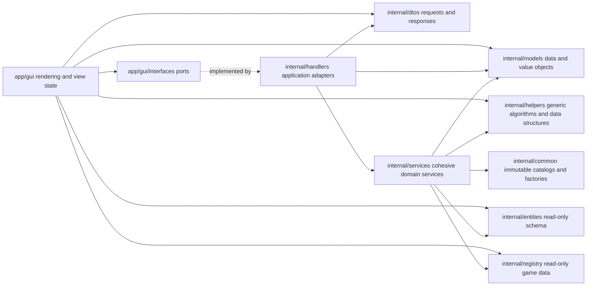

# Clean Architecture Refactoring

Refactor `app/` and `internal/` incrementally so the GUI depends on stable handler ports and DTOs, domain behavior has one clear owner, entity creation follows consistent builders/factories, and service packages expose cohesive objects instead of unrelated package functions. Preserve generated `.rmg.json` output, `.gen.json` compatibility, preview behavior, and cross-platform operation throughout.

## For Future Agents

As work proceeds: mark checkboxes `- [x]` as items complete; when a phase is done,
set its status to `Complete` and write its **Phase Summary** (what was done, key
decisions, anything needed to continue with zero context); run the phase's
**Verification Plan** and record the result before moving on. When all phases are
done, fill in **Final Recap** and **Deployment Plan**.

Each phase is intended to be independently reviewable and reversible. Do not combine phases into a repository-wide move. Before every phase, record baseline unit coverage and commit or otherwise preserve a clean comparison point. After every implementation change, add or move tests according to `AGENTS.md` section 4.6, run focused tests first, then the complete required verification.

## Scope And Non-Negotiable Constraints

- Production-code investigation and refactoring scope is `app/` and `internal/` only. Tests and architecture checks under `test/` must be updated as required by `AGENTS.md`; documentation is updated only where a moved public boundary would otherwise be misleading.
- Never modify `data/`, `internal/entities/template/`, or `internal/registry/`. The aliases in `internal/entities/types.go` may be read but should not be changed as part of this refactor.
- Do not change entity fields, JSON tags, serialized names, `.gen.json` formats, registry values, or generated `.rmg.json` semantics.
- `internal/**` must never import `app/**`.
- `app/**` may import only `internal/common/**`, `internal/dtos/**`, `internal/entities/**`, `internal/handlers`, `internal/helpers/**`, `internal/models/**`, and `internal/registry`.
- `app/gui` must not import `internal/services/**`, `internal/mappers`, or `internal/validators` after Phase 1.
- Keep Windows and Linux compatibility. Use `path/filepath` and platform build tags where needed.
- Preserve the existing `app/gui` package categories. They already express useful UI ownership and should not be reorganized merely for naming symmetry.
- Prefer constructor injection at package boundaries, but do not create interfaces for objects that have only one local implementation and no testing or dependency-direction benefit.
- Preserve public compatibility during each migration with short-lived forwarding methods where necessary; remove those shims in Phase 8.

## Review Method And Current Evidence

The review inspected production Go code under `app/` and `internal/`, starting from the requested examples and following representative callers. The following findings are concrete migration inputs, not generic Clean Architecture advice.

### Boundary Violations

The GUI currently bypasses `internal/handlers.GUIHandler` in these places:

- `app/gui/dialogs/ruleDialog.go` calls `GetVariantsForContent`, `GetDistanceDisplayNames`, and `CreateRuleFromSavedRule`, and reads the five `Rule*Name` values. Replace discovery with `ContentRuleHandler.GetEditorOptions`, rule-name constants with stable option keys, and display reconstruction with `ContentRuleHandler.DescribeRule`.
- `app/gui/dialogs/zoneContent.go` calls `GetVariantsForContent` and `CreateRuleFromSavedRule`, and compares against `RuleVariantName`. Replace these with the same content-rule option/description DTOs so the dialog never constructs a `ContentRule` implementation.
- `app/gui/dialogs/zoneEditorDialog.go` calls `ComputeHasErrors`, `FindIsolatedZones`, `NewDefaultConnection`, `FindOpenPosition`, `NextFreeZoneLabel`, `NewDefaultNeutralZone`, `CanDeleteZone`, and `RemoveZone`, and constructs `PreviewLayoutService`. Replace those calls with `ZoneEditorHandler` commands/queries and `PreviewHandler.BuildLayout`.
- `app/gui/dialogs/zoneEditorZoneProps.go` imports `internal/services/connection_editor` to count castles and re-profile zones.
- `app/gui/drivers/stateManualEdits.go` imports `internal/services/connection_editor` to apply castle-setting changes.
- `app/gui/panels/previewPanel.go` imports `internal/services/preview_service` and creates its own `PreviewLayoutService`.
- `app/gui/drivers/state.go` imports `internal/mappers` and creates a `GeneratorConfigMapper`.
- `app/gui/models/editorState.go` imports `internal/validators` and runs domain validation directly.

No production package under `internal/` currently imports `app/`. Preserve that good direction and add an automated guard before moving more code.

### Misplaced Model Behavior

- `internal/models/position.go` owns plan-based radial placement, closest-component search, bounds calculation, and a complete Bowyer-Watson Delaunay triangulation. These are algorithms, not data normalization.
- `internal/models/zoneAdjacency.go` owns graph mutation, breadth-first distance calculation, and connected-component discovery. The types are domain graphs, not passive data models.
- `internal/models/neutral_zone/neutralZoneQuality.go` mixes reasonable enum/value methods with entity classification based on layout, pools, resources, and naming conventions. `GetQualityFrom` and its checks are service behavior.
- `internal/models/neutral_zone/neutralZoneProfile.go` stores a valid profile model, but `NewNeutralZoneProfile` is a game-balance catalog/factory assembled from registry values. Move the factory and immutable values to `internal/common/common_zones`; a stateless service object would add no value.
- `internal/models/generationTuning.go` is mostly a valid value object. Its scaling methods may remain; only configuration-derived construction should be considered for a factory if doing so reduces coupling.
- `internal/models/config/generatorConfig.go` contains some policy methods. Keep simple aggregate/value accessors, but move topology, victory, or generation policies only when a phase has a clear service owner. Do not mechanically strip all methods from models.

### Functional Service Packages

- `internal/services/connection_editor` is a cohesive domain split across package-level functions in `connectionEditor.go`, `zoneEditor.go`, and `manualReapply.go`; callers can select arbitrary helpers instead of depending on a clear service contract.
- `internal/services/content_rules/contentRuleManager.go`, `distancePresets.go`, and `variantMappingManager.go` form a service/catalog but expose globals and package functions.
- `internal/validators/editorStateValidator.go` is a package-function validator even though the required target style is a validator struct with methods.
- `internal/services/preview_service`, `internal/services/file_service`, the template generator, providers, builders, mapper, and asset provider already use cohesive structs. Preserve those patterns rather than rewriting them for uniformity.

### Duplicate Or Divergent Sources Of Truth

- Road/content distance labels exist in three places:
  - `internal/services/builders/placement_rule/distance.go`
  - `internal/services/content_rules/distancePresets.go`
  - `app/gui/constants/roadDistances.go`
- Four bands currently match, but `Near` does not: portal/crossroads placement uses `0.075..0.35`, while content rules use `0.1..0.25`. The latter explicitly claims parity with the C# presets. Therefore this is duplicated vocabulary with a semantic discrepancy, not yet proof that one bound can replace the other.
- Generation and preview each encode topology capabilities such as fixed geometry, scatter layout, hub use, generator positions, and generator rings. Adding a topology requires synchronized edits in multiple switches.
- `RandomTopologyService` is embedded by non-random topologies to reuse a positioned graph-to-variant pipeline, so its name and responsibility are misleading.

### Entity Construction And Neutral-Like Zones

- Builders already cover `Zone`, `Connection`, `Road`, `MainObject`, `Variant`, `TypedRef`, `Orientation`, `Border`, `PlacementRule`, and mandatory content items.
- Direct `entities.Connection` construction remains in `connection_editor.NewDefaultConnection`, `TopologyBase.CreateMissingPlayerConnections`, and tournament balanced-cluster generation. Convert these after adding any missing builder options such as `WithIsUserAdded`.
- Post-build writes of `GeneratorPosition` and `GeneratorRing` are derived topology metadata and may remain explicit mutations if they occur after geometry is computed. Do not add a builder merely to hide a legitimate second-stage enrichment.
- Tournament hub creation calls `CreateHubZone` and then mutates `hubZone.Name` to `Hub-<label>`. Make the name an explicit creation input.
- `CreateHubZone` and `CreateNeutralZone` share the neutral-zone profile and most zone fields, but hub behavior differs in castle guards/buildings, hold-city semantics, mandatory-content grouping, foothold exclusion, abandoned-outpost exclusion, guard randomization, roads, and naming. Unify their common construction through an explicit neutral-like zone factory; do not implement hub creation as a blind call to the current neutral method.

### Common Package Composition

The requested target says `internal/common` contains values and factories but no struct declarations. Current exceptions are:

- `internal/common/mapSizes.go`: `MapSize`
- `internal/common/common_connections/guardStrength.go`: `GuardStrength`
- `internal/common/common_connections/guardWeeklyIncrement.go`: `GuardWeeklyIncrement`
- `internal/common/common_topologies/topologies.go`: `TopologyDescriptor` and `TopologyDescriptors`

Move these type declarations to focused `internal/models` files while retaining immutable values and getter/factory functions in `internal/common`.

### Deliberate Non-Goals

- Recommend keeping `app/gui/themes` in place: the package owns both palette values and a `material.Theme` factory, so it is not purely a constants package and moving it would not reduce coupling. If the owner still prefers `app/gui/constants/themes`, perform that as a standalone mechanical move after this architecture refactor, with unchanged API and visual snapshot coverage.
- Do not rename every underscore-containing service package in this effort. Import churn does not address the dependency or ownership problems and would make behavior review harder.
- Do not introduce repository, command bus, event bus, dependency-injection framework, or generic use-case interface solely to resemble textbook Clean Architecture.
- Do not add builders for simple root aggregate literals that have one readable construction site and no invariants. Builders are required where they centralize defaults, registry values, or cross-field invariants.
- No entity-schema suggestion is warranted by the findings. All required changes can be implemented outside the read-only entity packages.

## Target Architecture

### Boundary Rules

1. Gio widgets, layout, click handling, and transient view state stay in `app/gui`.
2. GUI actions are expressed as methods on small GUI-side interfaces in `app/gui/interfaces`. Concrete handlers satisfy these interfaces without importing `app`.
3. Requests and responses crossing the GUI/internal boundary are structs in `internal/dtos`. A DTO may embed an internal model or entity when that avoids lossy mapping, but it must not expose a service object.
4. `internal/handlers` validates requests, maps DTOs, invokes services, translates errors, and coordinates transactions such as template-save plus preview-save. It does not contain generation algorithms.
5. `internal/services` owns domain decisions and mutations. Each service package exposes a cohesive struct with receiver methods when state, dependencies, or a meaningful operation family exists.
6. `internal/models` owns data structures and small value semantics such as normalization, enum labels, scalar checks, and local collection operations. It does not own graph traversal, triangulation, entity classification, file IO, orchestration, or generation policy.
7. `internal/helpers` owns genuinely generic algorithms and reusable data structures. Domain-specific policy must not be hidden there to avoid creating a service.
8. `internal/common` owns immutable shared values and factory/getter functions. Public struct declarations live in `internal/models`.

## Phase 0: Baseline And Characterization

Status: Complete

- [x] Record `git status --short` and avoid touching unrelated user changes.
- [x] Run the coverage commands from `AGENTS.md` and record total coverage plus focused coverage for the first phase's touched packages.
- [x] Run `go build ./...`, `go test ./test/... -count=1`, and the gated integration/performance suites to establish a green baseline.
- [x] Add `test/unit/architecture/dependency/dependency_test.go` (`package dependency_test`) to parse imports under production `app/` and `internal/` and fail on `internal -> app` or GUI imports outside the allowed internal package list.
- [x] Add only the Phase 1 characterization tests now: handler generation/update/save/load, state validation warnings, preview layout, content-rule option/description responses, and manual-update behavior. Add topology and neutral/hub characterization immediately before Phases 5-6 so test preparation does not block earlier boundary work.
- [x] Add exact characterization tests for current content-distance and portal-distance bounds, including the two different `Near` values. Trace the portal `0.075..0.35` value to its source in the implementation history or upstream reference used by this project and record whether it is intentional, copied, or arbitrary; do not inspect or modify authoritative project data to do so.
- [x] Record representative Phase 1 outputs as in-memory expected structs or hashes in tests; do not add or edit files under `data/`.

### Phase 0 Verification Plan

- `go test -count=1 '-coverpkg=./internal/...,./app/...' '-coverprofile=coverage.txt' ./test/unit/...` succeeds and establishes the baseline percentage.
- `go tool cover '-func=coverage.txt'` is recorded in this phase summary.
- `go build ./...` succeeds.
- `go test ./test/... -count=1` succeeds.
- `go test -tags=integration_test ./test/integration/... ./test/performance/... -count=1` succeeds.
- The new architecture test first demonstrates the known GUI-to-service violations, then is configured to block only regressions until Phase 1 removes the baseline exceptions. Do not leave a permanently growing allowlist.

### Phase 0 Summary

Complete. Before Phase 0 implementation, `git status --short` reported only the untracked `plans/` directory. Baseline and post-change unit coverage were both 63.9%. The dependency test proves that `internal` does not import `app` and locks the exact current GUI boundary debt against regressions. Existing focused tests characterize handler generation/update/save/load, state validation and fixes, preview layouts, content-rule discovery/descriptions, variants, and manual updates; the generation warning and literal portal-distance bounds were added where exact output was missing. The focused Phase 1 characterization command passes.

The content-rule `Near` preset remains `0.1..0.25`, while portal/crossroads placement remains `0.075..0.35`. Git history shows commit `0701f5be` (`More refactoring and other changes (#25)`) deliberately changed the latter from `0.0..0.35` to `0.075..0.35` while moving the file. The commit and repository documentation cite no upstream source or rationale, so provenance is classified as an intentional code change with undocumented source, not as proven parity with the C# presets. Preserve both values unless their semantics are explicitly reconciled later.

Final Phase 0 verification passed: `go build ./...`, `go test ./test/... -count=1`, and `go test -tags=integration_test ./test/integration/... ./test/performance/... -count=1`. No authoritative data, entity schema, or registry files were modified.

## Phase 1: Enforce The GUI Boundary

Status: Complete

- [x] Split `app/gui/interfaces.ITemplateHandler` into focused workflow, persistence, validation, preview, content-rule, and zone-editor ports composed by `IBackend`. The current `I` prefix follows the reviewed local convention and is deferred to the naming cleanup phase.
- [x] Keep `internal/handlers.GUIHandler` as a compatibility facade initially. It delegates to existing mapper/service collaborators without expanding its constructor; internal handler/service-object decomposition remains Phase 3 work.
- [x] Add request/response DTOs, one primary struct per file, for preview layout, content-rule editing, zone-editor commands, and state validation. Prefer operation-specific DTOs over one catch-all payload. Use these concrete boundary shapes as the starting contract:
  - `BuildPreviewLayout(request dtos.PreviewLayoutRequestDto) (dtos.PreviewLayoutDto, error)`, carrying zones, connections, topology, and canvas side in and the existing preview model out.
  - `ValidateEditorState(state dtos.EditorStateDto, fixIssues bool) dtos.EditorStateValidationDto`, carrying normalized state and warnings out.
  - `GetContentRuleEditorOptions(content models.SidMapping) dtos.ContentRuleEditorOptionsDto`, carrying stable rule keys, labels, editor kind, distances, and variant ID/label options.
  - `DescribeContentRule(content models.SidMapping, saved models.ContentRuleRowSave) dtos.ContentRuleDescriptionDto`, carrying display text and validity.
  - `EditZones(request dtos.ZoneEditorRequestDto) (dtos.ZoneEditorResultDto, error)` only for mutations that must be atomic; keep cheap read-only queries as focused methods instead of an action enum.
- [x] Replace `TemplateUpdateDto.Config *config.GeneratorConfig` with editor-state input sufficient for the handler to map internally. The GUI must no longer create or retain `GeneratorConfigMapper` merely to update manual zones.
- [x] Add a handler operation that validates an `EditorStateDto` and returns normalized state plus warning messages. Route `app/gui/models/editorState.go` through the injected handler/port instead of importing `internal/validators`.
- [x] Add preview-layout handling that accepts template/topology/canvas inputs and returns a DTO containing the preview model. Inject the port into `PreviewPanel` and `ZoneEditorDialog`; remove their `preview_service` imports and local service construction.
- [x] Add content-rule query/edit operations that return UI-neutral descriptors: stable rule key, display name, description, marker, allowed distances, allowed variants, and the persisted `ContentRuleRowSave`. The GUI edits saved rule data; only internal services reconstruct and apply `ContentRule` implementations.
- [x] Replace content-rule name constants in GUI switches with stable DTO rule keys or option descriptors supplied by the handler.
- [x] Add zone-editor operations for default zone/connection creation, zone removal, quality application, castle counting, connection validation, isolated-zone discovery, open-position calculation, and castle-setting reapply. Use DTOs that carry entities where preserving the exact editor snapshot matters.
- [x] Inject focused ports through state, preview, content-rule, layout, and zone-editor constructors; wire one concrete backend in `editor.NewWindow`. Tests use the shared backend fake without a service locator.
- [x] Route `drivers.State.ApplyEditedZones` and castle reapply through the handler so UI drivers no longer call `connection_editor`.
- [x] Remove all imports of `internal/services/**`, `internal/mappers`, and `internal/validators` from `app/gui/**`.
- [x] Tighten the Phase 0 architecture test so these imports fail with no baseline exceptions.
- [x] Add compile-time interface satisfaction checks in `app/gui` composition code, where importing both the GUI port and concrete internal handler follows the allowed dependency direction.

### Phase 1 Verification Plan

- A source import scan reports no `app/gui` imports of `internal/services`, `internal/mappers`, or `internal/validators`.
- Focused handler, driver, dialog-state, preview-panel, and editor-state tests pass.
- Existing generated template, preview layout, manual edit, save/load, and warning behavior remains byte-for-byte or struct-for-struct equivalent to Phase 0 characterization tests.
- Run the full build, unit coverage, default tests, and gated suites from Phase 0; total coverage must not decrease.

### Phase 1 Summary

In progress. Replaced the broad `ITemplateHandler` with focused `TemplateWorkflowHandler`, `StatePersistenceHandler`, `StateValidationHandler`, `PreviewHandler`, and `ContentRuleHandler` ports composed by `Backend` for `drivers.State`. Added `EditorStateValidationDto` and `GUIHandler.ValidateEditorState`; generation and load reuse the same operation, while `app/gui/models.EditorState` now receives validation through its injected port and no longer imports `internal/validators`. Added `PreviewLayoutRequestDto`, `PreviewLayoutDto`, and `GUIHandler.BuildPreviewLayout`; the request preserves the complete template input so `ZeroAngleZone` rotation semantics are unchanged. `editor.NewWindow` constructs one backend and injects its preview port through `PreviewPanel`, `LayoutPanel`, and `ZoneEditorDialog`, removing both GUI `preview_service` imports and local service construction.

Added stable content-rule key/editor enums plus option, variant, editor-options, and description DTOs. `GUIHandler.GetContentRuleEditorOptions` preserves the pre-migration dialog order `Road`, `Town`, `Guarded`, `Solo`, then conditionally appended `Variant`; this intentionally differs from the service prototype catalog order. `GUIHandler.DescribeContentRule` centralizes reconstruction, marker, display text, validity, and variant-label behavior while preserving historical `ContentRuleRowSave.Name` values for `.gen.json` compatibility. `RuleDialog`, `ZoneContent`, `ZoneContentDialog`, `LayoutPanel`, and editor composition now consume the focused port and have no direct `content_rules` dependency. Handler characterization tests and a headless Gio integration test cover options, variants, descriptions, invalid fallback, dialog rendering, and row persistence. Resolved content-rule exceptions were removed from the architecture debt map.

At the content-rule checkpoint, focused lint and diagnostics were clean; the broader dialog lint scan reported only five pre-existing findings in `zoneEditorCanvas.go` and `bonusPickerDialog.go`. `git diff --check`, full build, unit/default tests, integration, headless GUI, and performance-package checks passed at 64.0% coverage. A read-only review found no hard bugs; its possible Solo/Variant order concern was dismissed after confirming the exact pre-migration append order. The zone-editor boundary was completed in the final Phase 1 checkpoint below.

Completed the mapper/manual-edit boundary. `TemplateUpdateDto` now carries optional `EditorState` instead of a mapped `GeneratorConfig`; `GUIHandler.UpdateTemplate` owns mapping before rebuilding mandatory content. Added `CastleSettingsReapplyRequestDto` and `GUIHandler.ReapplyCastleSettings`; `drivers.State.reapplyManualEdits` now passes zones, castle changes, and current editor state through the backend instead of importing `connection_editor`. The shared backend mock defaults this operation to identity, and the resolved `stateManualEdits.go` service exception was removed from the architecture debt map. Focused tests prove the driver sends current state, handler output is exactly equivalent to the old mapper-plus-service path, and a manually promoted High zone receives High-tier editor content rather than Medium-tier content.

Completed the zone-editor boundary with `IZoneEditorHandler` and operation-specific option, graph, connection, neutral-zone, quality, removal, and mutation DTOs. `GUIHandler` now owns generator-config mapping for editor options and delegates graph/zone operations to the existing services. `LayoutPanel` requests topology, tuning, and road settings through the port; `ZoneEditorDialog` uses the port for status, creation, deletion, positioning, castle count, and quality changes. `drivers.State` no longer owns a mapper or exposes `GetGeneratorConfig`. The architecture test now requires an empty forbidden-import set, and a source scan confirms `app/gui` imports no `internal/services`, `internal/mappers`, or `internal/validators` packages.

Handler characterization tests cover every new public operation, and a headless Gio integration test renders the real zone editor with handler-provided options. The pre-existing manual-editor convention intentionally computes tuning from the full active variant zone count; hub/generation count semantics are recorded for Phase 3 reconciliation rather than changed here. Final Opus review found no hard bugs. Full build, unit/default tests, integration, headless GUI, performance-package checks, focused lint, diagnostics, and whitespace checks pass at 64.1% coverage, above the 63.9% baseline. Package-level dialog lint reports only the five pre-existing findings in `zoneEditorCanvas.go` and `bonusPickerDialog.go`. No protected directory was modified.

## Phase 2: Restore Model And Algorithm Ownership

Status: Complete

- [x] Reduce `internal/models/position.go` to position/connection-index data aliases or simple collection behavior.
- [x] Create a focused topology `PositionLayoutService` under `internal/services/template_generator/providers/topology` for `CreatePositionsFromPlans`, because tier radii and plan placement are generation policy.
- [x] Move generic Delaunay triangulation, bounds, and closest-cross-component calculations into `internal/helpers/geometry` as narrowly named pure functions such as `CreateDelaunayTriangulation(positions []data.Vec2[float64])` and `FindClosestAcrossComponents(positions, components)`. Introduce a struct only if a real configurable dependency appears. This removes algorithms from data models without wrapping stateless math in empty objects.
- [x] Update random, circles, tournament-balanced, and topology-base callers to use the new owners through fields initialized by constructors.
- [x] Move zone graph traversal out of `internal/models/zoneAdjacency.go` into `internal/helpers/graph` as pure `Link`, `DistancesFrom`, and `ConnectedComponents` operations over generic/passive adjacency data. Keep zone-specific label selection in `internal/services/zones`. This matches the requested helper role and avoids an empty stateless service wrapper.
- [x] Move entity-derived quality classification from `neutral_zone.GetQualityFrom` into `internal/services/zones.ZoneClassifier` with a receiver method such as `GetQuality(zone entities.Zone) neutral_zone.Quality`.
- [x] Keep `Quality.GetName`, `GetIndex`, `GetGuardValue`, `GetBalanceScore`, and index conversion as value/enum behavior in models.
- [x] Keep zone-name parsing that is truly lexical in `internal/helpers/zone_helpers`; move any policy using entity contents, connection guard rules, or registry profiles into `ZoneClassifier` or another zone service.
- [x] Replace preview, mandatory-content, connection-editor, and handler callers of model classification with the classifier dependency.
- [x] Move neutral profile assembly from `neutral_zone.NewNeutralZoneProfile` to `internal/common/common_zones.GetNeutralZoneProfile`. Keep `neutral_zone.Profile` as passive data, keep registry access inside the common factory, and return fresh slices so callers cannot mutate catalog state.
- [x] Evaluate `NewGenerationTuning` separately. Move construction to `GenerationTuningFactory` only if callers otherwise require generator config in a lower-level model package; keep scalar `ScaleBy*` methods on the value object.
- [x] Move tests with the implementation ownership and preserve one public method per test file as required by `AGENTS.md`.

### Phase 2 Verification Plan

- `internal/models` no longer imports `internal/entities` solely to classify or transform entities.
- `internal/models/position.go` contains no triangulation or plan-placement algorithm.
- `internal/models/zoneAdjacency.go` is removed or reduced to passive types with no BFS/component traversal.
- Focused geometry tests include 0/1/2 points, duplicate/collinear points, winding independence, disconnected components, and deterministic edge normalization.
- Focused zone-classifier tests cover player, neutral tiers, hub/highest, missing layout, empty pools, and unknown data.
- Full build, coverage, default tests, and gated suites pass without a coverage decrease.

### Phase 2 Summary

Complete. Reduced `internal/models/position.go` to passive aliases plus append behavior. Generation-specific tier placement now belongs to `topology/position_layout.PositionLayoutService`; generic Delaunay triangulation, component bounds, and closest-cross-component selection now live as pure functions in `internal/helpers/geometry`. Delaunay edges are normalized and lexicographically sorted, making the previously map-ordered result deterministic. Focused tests cover 0/1/2 points, duplicate and collinear positions, winding independence, bounds, disconnected components, and deterministic edge output.

Replaced `internal/models/zoneAdjacency.go` with generic `internal/helpers/graph` adjacency operations for undirected linking, breadth-first distances, and connected components. Zone-specific topology construction remains in `internal/services/zones` and topology services. Entity-derived neutral quality and connection-guard classification now belong to `zones.ZoneClassifier`; preview, mandatory-content, manual-edit, zone-editor, handler, and GUI callers use the classifier directly or through focused GUI port methods. `internal/helpers/zone_helpers` now contains lexical name parsing only, while neutral quality enum labels, indexes, guard values, and balance scores remain model value behavior.

Moved registry-backed neutral profile assembly to `common/common_zones.GetNeutralZoneProfile`; `neutral_zone.Profile` is passive data and every returned slice is fresh. Moved generator-config tuning construction into the cycle-free `template_generator/generation_tuning.GenerationTuningFactory` because the old model constructor imported a generator service utility; scalar `ScaleBy*` methods remain on `models.GenerationTuning`. Tests moved with implementation ownership, and topology fixtures use one shared test helper that delegates to the production factory.

Final verification passed: `go build ./...`; exact unit coverage at 64.2%, above the 64.1% Phase 1 checkpoint; `go test ./test/unit/... -count=1`; `go test ./test/... -count=1`; tagged integration; tagged headless GUI integration; tagged performance package checks; diagnostics; architecture guard; and `git diff --check`. A Fable read-only review found no hard bugs and approved the phase. It confirmed preview, mandatory-content, manual-edit, and zone-editor behavior is preserved; deterministic normalized Delaunay edge order is the only intentional behavioral change. No file under `data/`, `internal/entities/template/`, or `internal/registry/` was modified.

## Phase 3: Convert Functional Packages To Cohesive Services

Status: Complete

- [x] Introduce `validators.EditorStateValidator` with `NewEditorStateValidator` and `Validate`. Convert validation helpers that are part of its policy to receiver methods; keep field descriptor types private and in separate files if required by the one-struct-per-file rule.
- [x] Inject one validator instance into the relevant handler workflow. Remove the package-level `ValidateEditorState` after callers and tests migrate.
- [x] Introduce `content_rules.ContentRuleService` owning rule prototypes, restore/create/apply operations, a distance catalog dependency, and a variant catalog dependency.
- [x] Introduce `content_rules.VariantMappingCatalog` with immutable constructor-owned mappings instead of exported mutable globals. Return copies from query methods.
- [x] Keep each concrete `ContentRule` implementation as its existing focused object; do not fold all rule behavior into one switch-based service.
- [x] Introduce `connection_editor.ConnectionEditorService` for default connections, duplicate-name checks, isolated-zone discovery, and connection error computation.
- [x] Introduce `connection_editor.ZoneEditorService` for zone defaults, quality changes, castle counts, deletion, open-position selection, connection naming, and road rebuilding.
- [x] Introduce `connection_editor.ManualReapplyService` for castle-setting propagation and neutral/hub castle rebuilds. Inject shared zone/castle/road collaborators rather than importing generator topology internals long term.
- [x] Keep private pure helpers private to their owning service file or a sibling file named for a private helper struct. Avoid one public service per former function.
- [x] Change handler constructors to receive dependencies through an explicit dependency struct or focused constructor parameters. Provide a production constructor that wires defaults and test constructors that accept mocks/fakes.
- [x] Split `GUIHandler` orchestration internally into template workflow, state persistence, template persistence, preview, content rule, and zone editor handlers if its fields/methods remain unrelated after injection. Preserve the GUI-facing facade until all ports are stable.
- [x] Audit every `GeneratorConfigMapper` method against the mapper rule. Direct field copies and shape conversion remain; move policy derivation out, notably deciding whether `mapGameEndConditions` setting `CityHold` from `VictoryCondition` is required normalization or a template-workflow policy. Add a mapper test for the chosen boundary and do not let mapping call generation services except a dedicated row-to-model mapper.
- [x] Verify that `GeneratorConfigMapper`, `FileService`, `PreviewLayoutService`, `PreviewGeneratorService`, `AssetProvider`, template generator/providers, and builders remain cohesive; do not rewrite already-correct object-oriented services.

### Phase 3 Verification Plan

- Public non-constructor functions in `internal/validators`, `internal/services/content_rules`, and `internal/services/connection_editor` are eliminated unless they are documented pure value factories.
- Service constructors initialize all mandatory collaborators and return errors for initialization failure instead of leaving partially usable services where practical.
- Focused service tests cover every public receiver method and error branch.
- Handler tests use injected collaborators and assert orchestration without requiring the full generator when a unit test is sufficient.
- Full build, coverage, default tests, and gated suites pass without a coverage decrease.

### Phase 3 Summary

Complete. `EditorStateValidator` now owns editor-state policy and is injected into `GUIHandler`. `ContentRuleService` now owns rule prototypes, restoration, creation, and application through constructor-owned `DistanceCatalog` and `VariantMappingCatalog` collaborators. The handler and mandatory-content provider each use one service instance; concrete rule objects remain focused and unchanged in responsibility. Legacy package functions and exported mutable distance/variant catalogs were removed, and catalog queries return fresh slices including deep copies of nested variant tuples.

`ConnectionEditorService`, `ZoneEditorService`, and `ManualReapplyService` now own graph validation, connection defaults, zone mutation/road rebuilding, and castle-setting reapplication. `GUIHandler` shares its classifier, zone editor, and tuning factory with these services; `MandatoryContentProvider` uses an owned zone editor for castle counting. Topology-backed castle and road construction is private to `ZoneEditorService`, so manual reapply depends on that collaborator rather than importing topology internals. All former public connection-editor package functions were removed, and tests moved to folders matching the service owners.

Checkpoint verification passed at 64.3% coverage, above the 64.2% Phase 2 baseline: focused service, handler, and mandatory-content suites; `go test ./test/unit/... -count=1`; `go build ./...`; tagged integration; and tagged headless GUI integration. Constructor injection, mapper ownership, handler cohesion, and service cohesion were completed in the subsequent checkpoints.

A Fable read-only review approved the validator, content-rule, and connection-editor checkpoint with no hard findings. It confirmed the ordering, mutation, castle/road rebuild, fallback, and dependency-sharing invariants. Deferred constructor nil-guard work remains part of the open constructor-boundary item; the already-recorded Phase 5 work still owns removal of the temporary `connection_editor` dependency on generator topology internals.

The mapper audit moved editor `ZoneContentRowSave` normalization, multiplicity, group/SID mapping, and content-rule application from `MandatoryContentProvider` into `mappers.MandatoryContentItemMapper`; `GeneratorConfigMapper` no longer imports generator providers. Per the confirmed boundary decision, `GameEndConditions.CityHold` now preserves the persisted `EditorStateDto.CityHold` flag instead of deriving it from `VictoryCondition`; downstream `IsCityHoldMode` and game-rule generation continue to interpret the victory condition. Preview-generator initialization remains optional by design: `NewGuiHandler` logs asset initialization failure and returns a handler that skips preview-image saving. A read-only cohesion audit found the mapper, file/preview/asset services, generator/providers, and builders otherwise cohesive and left them unchanged. Full mapper checkpoint coverage, unit, build, and tagged integration gates passed at 64.3%.

`GUIHandler` is now a thin compatibility facade over six focused internal handlers: template workflow, state persistence, template persistence, preview, content rule, and zone editor. `GUIHandlerDependencies` and `NewGuiHandlerWithDependencies` expose explicit workflow injection with validation for every mandatory collaborator, while `NewGuiHandler` remains the production composition root and shares mapper, validator, classifier, zone-editor, tuning, connection-editor, and file-service instances where workflows require identical policy. Preview-image generation remains the only optional production collaborator. Dependency interfaces each live in their own file, and facade delegation is covered with injected stubs.

The connection-editor dependency constructors now replace nil mandatory collaborators with working defaults, preventing partially usable services without breaking their public signatures. Final verification passed: 64.6% unit coverage, above the 64.3% checkpoint; 2,104 unit tests; `go build ./...`; default tests; tagged integration; tagged headless GUI integration; tagged performance package checks; architecture guard; diagnostics; touched-handler lint; and `git diff --check`. Broader touched-package lint reports only eight pre-existing formatting findings in untouched tests. Claude Fable 5 approved Phase 3 with no hard findings; its only file-layout suggestion was applied by splitting the dependency interfaces into separate files. No protected directory was modified.

## Phase 4: Consolidate Catalogs And Common Types

Status: Complete

Baseline recorded before Phase 4 edits: branch `AD/refactoring-07-21` was clean and
up to date with `origin/AD/refactoring-07-21`; `git diff --check` passed; unit
coverage passed at 64.7%.

- [x] Add passive model types for `DistancePreset`, `MapSize`, `GuardStrength`, `GuardWeeklyIncrement`, and `TopologyDescriptor`, each in its own correctly named file under `internal/models` or a focused model subpackage.
- [x] Move only the type declarations out of `internal/common`; keep immutable values and copy-returning getters/factories there.
- [x] Replace public mutable slices/maps in common catalogs with private values and getters that return copies.
- [x] Create one distance vocabulary/catalog owner. Preserve separate semantic contexts initially: `ContentDistance` and `PortalPlacementDistance` (or equivalent explicit names).
- [x] Represent shared labels and the four identical bounds once. Represent the differing `Near` values explicitly by context so the discrepancy cannot be hidden behind the same global variable.
- [x] Default decision: preserve current behavior (`Content Near = 0.1..0.25`, `Portal Near = 0.075..0.35`) because changing portal bounds changes generated templates. Use the source/history evidence recorded before this phase to propose a correction; unify the numeric value only after the owner explicitly confirms that the divergence is a bug and characterization tests are intentionally updated.
- [x] Make `PlacementRuleBuilder` consume the portal-placement catalog and `ContentRuleService` consume the content catalog.
- [x] Make the handler expose distance option DTOs to the GUI. Delete `app/gui/constants/roadDistances.go` once no caller remains.
- [x] Audit `app/gui/constants/contentIds.go`, `includeListIds.go`, and `contentItemGroups.go` by usage. A catalog is domain-owned when production `internal/` code needs the same semantic value; it is presentation-only when all production references are under `app/gui/`. Move only domain catalogs to `internal/common` with model types; do not move them preemptively.
- [x] Keep `app/gui/themes` in place, as decided in the non-goals.

### Phase 4 Verification Plan

- `internal/common/**/*.go` contains no public struct declarations.
- No mutable public catalog variables remain in the touched packages.
- Distance display order remains `Any`, `Next To`, `Near`, `Medium`, `Far`, `Very Far` where applicable.
- Content and portal distance characterization tests either preserve their context-specific bounds or document the explicitly approved behavior change.
- Full build, coverage, default tests, and gated suites pass without a coverage decrease.

### Phase 4 Summary

Complete. Moved `MapSize`, `GuardStrength`, `GuardWeeklyIncrement`,
`TopologyDescriptor`, its aggregate catalog shape, and `DistancePreset` into
one-struct-per-file passive models. `internal/common` now declares no public
structs. Map-size catalog slices are private and every public slice getter
returns a copy; GUI callers retain the same base-prefix/all-size index
semantics.

Added `common/common_distances` as the single distance vocabulary owner. The
four shared bands are assembled once while explicit context factories preserve
content `Near = 0.1..0.25` and portal placement `Near = 0.075..0.35`.
`ContentRuleService` consumes the content catalog, and `PlacementRuleBuilder`
uses the portal catalog for near-castle and near-crossroads rules. The unused
mutable GUI `RoadDistances` list and the duplicate placement/content distance
types were removed. Existing handler DTOs remain the sole GUI distance-option
path, with display order `Next To`, `Near`, `Medium`, `Far`, `Very Far`;
historical `Any` behavior is unchanged because it was never part of the live
content catalog or persisted rule options.

Production usage confirmed `contentIds.go`, `includeListIds.go`, and
`contentItemGroups.go` are presentation-only; internal references are tests,
so the catalogs remain under `app/gui/constants`. `app/gui/themes` was left
unchanged. Final verification passed at 64.7% coverage, equal to the Phase 4
baseline: complete unit and default suites, `go build ./...`, tagged
integration, tagged headless GUI integration, tagged performance packages,
architecture/diagnostic checks, focused new-package lint, and
`git diff --check`. Broader touched-package lint reported only existing
global-catalog/style findings outside the new distance package. Claude Fable 5
approved Phase 4 with no hard findings. No protected directory was modified.

## Phase 5: Consolidate Neutral And Hub Zone Creation

Status: Complete

Baseline recorded before Phase 5 edits: branch `AD/refactoring-07-21` was clean and
up to date with `origin/AD/refactoring-07-21`; unit coverage passed at 64.7%.

The initial model that a hub is "just a highest-quality neutral zone" is correct for the shared profile-based zone shell, but incomplete for current behavior. Hub castle strategy, hold-city guards, shared mandatory-content grouping, foothold/outpost exclusion, road counting, randomization, and tournament naming differ. The common factory must expose those differences explicitly rather than erase them.

- [x] Extract reusable zone, castle, and road creation from `template_generator/providers/topology/base.TopologyBase` into focused services under `internal/services/zones` (for example `ZoneFactory`, `CastleFactory`, and `RoadFactory`). Keep topology graph assembly in the topology packages.
- [x] Define passive creation input models with explicit fields rather than booleans whose meaning is unclear. The neutral-like zone input must include name, quality/profile, size, connection names, mandatory-content name, castle strategy, hold-city state, outpost count, foothold count, guard randomization, road generation, and biome-match policy.
- [x] Construct these collaborators once in `NewTopologyBase(zoneFactory, castleFactory, roadFactory)` or a dependency struct and pass the same factories to `connection_editor.NewZoneEditorService`. Do not use package globals; shared construction policy must be replaceable in focused tests.
- [x] Implement one private/shared neutral-like construction path in `ZoneFactory` that applies profile fields and delegates castle/road creation.
- [x] Implement `CreateNeutralZone` as a clear wrapper supplying per-label mandatory content, configured neutral profile, neutral castle strategy, optional outposts/footholds, and configured guard randomization.
- [x] Implement `CreateHubZone` as a clear wrapper supplying `QualityHighest`, explicit hub name, optional shared hub mandatory content, hub castle strategy, no outposts, no footholds, current hub guard randomization, and hub road counting.
- [x] Preserve hub-specific castle behavior: non-hold guard chance/value/buildings, hold-city value/quality/placement/win condition, and extra-castle behavior must remain distinct from highest-quality neutral castles unless a separate product change is approved.
- [x] Pass `Hub` or `Hub-<label>` into the factory. Remove tournament post-construction `hubZone.Name = hubName`.
- [x] Preserve mandatory-content behavior: one shared `mandatory_content_hub` group for multi-hub tournament generation, no hub footholds, and removal of near-castle rules when a hub has no castles.
- [x] Preserve road behavior: hub roads count castles only; neutral roads account for neutral main objects/outposts and footholds exactly as before.
- [x] Make `connection_editor.ZoneEditorService` depend on the shared zone/castle/road services rather than importing `template_generator/providers/topology/base`.
- [x] Keep public forwarding methods on `TopologyBase` as stable topology access points while focused private collaborators own their implementation.

### Phase 5 Verification Plan

- Phase 0 neutral/hub characterization tests compare equal before and after for every covered scenario.
- Tournament hub names are correct without post-build mutation.
- Manual castle reapply uses the same castle/road factories and preserves snapshot semantics.
- No package under `internal/services/connection_editor` imports `template_generator/providers/topology/base`.
- Full build, coverage, default tests, and gated suites pass without a coverage decrease.

### Phase 5 Summary

Complete. Extracted `ZoneFactory`, `CastleFactory`, and `RoadFactory` under
`internal/services/zones`. `ZoneFactory` owns spawn and the shared neutral-like
zone shell; explicit passive creation inputs preserve neutral quality, hub
highest-quality profile selection, hold-city behavior, mandatory-content names,
outposts, footholds, guard randomization, biome matching, and road policy.
`CastleFactory` retains distinct player, neutral, and hub castle strategies,
including hub non-hold guards and rich buildings, centered ultra-rich hold-city
castles, and extra-castle behavior. `RoadFactory` retains connector fanout and
outer-zone main-object, foothold, and connection roads.

Added `CreationServices` as the shared factory bundle and propagated it through
the production GUI composition root, `TemplateGenerator`, topology provider,
every topology and tournament-cluster constructor, `TopologyBase`, mandatory
content construction, and `connection_editor.ZoneEditorService`. The manual
editor no longer imports topology `base`; generation and editor workflows use
the same castle and road policy instances. Existing constructors and
`TopologyBase` forwarding methods remain as stable public access points over the
shared creation services.

Hub callers now pass `Hub` or `Hub-<label>` directly, so tournament generation
does not rename a built zone. Hubs structurally exclude outposts and footholds,
continue using one shared `mandatory_content_hub` group, and count castles only
for roads. Neutral zones retain per-label mandatory content and count castles,
outposts, and footholds as before. Spawn-zone naming uses the shared prefix
constant. Public factory tests cover creation semantics, factory-bundle
identity/defaults, and the live NaN/infinity/clamp/round size-normalization
path; topology characterization tests exercise the full neutral/hub branches.

Final verification passed: `go build ./...`; exact unit coverage at 64.9%,
above the 64.7% Phase 5 baseline; complete unit/default tests; tagged
integration; tagged headless GUI integration; tagged performance packages;
all template-generator tests repeated 20 times; focused new-package lint with
zero issues; code diagnostics; architecture searches; protected-path check;
and `git diff --check`. Claude Opus 5 reviewed the final phase; both hard
findings (spawn prefix ownership and live size-normalization coverage) were
fixed and their owning tests rerun. No file under `data/`,
`internal/entities/template/`, or `internal/registry/` was modified.

## Phase 6: Standardize Builders And Topology Composition

Status: Complete

Baseline recorded before Phase 6 edits: branch `AD/refactoring-07-21` was clean and
up to date with `origin/AD/refactoring-07-21`; unit coverage passed at 64.9%.

- [x] Document and enforce the local construction rule: use existing builders for invariant-rich generated `Zone`, `Connection`, `Road`, `MainObject`, `Variant`, `TypedRef`, `Orientation`, `Border`, `PlacementRule`, and mandatory-content items; allow simple literals for DTO/model/test data and root aggregates without construction invariants.
- [x] Add `ConnectionBuilder.WithIsUserAdded`: the runtime-only field already exists and `connection_editor.NewDefaultConnection` currently sets it directly. Do not modify the entity type.
- [x] Convert direct production connection literals in connection editing, missing-player repair, and tournament balanced clusters to `ConnectionBuilder`.
- [x] Audit direct production entity literals one entity type at a time. Convert only cases where an existing builder centralizes defaults or prevents invalid combinations; record justified exceptions in this plan's phase summary.
- [x] Preserve explicit second-stage mutations for derived topology metadata (`GeneratorPosition`, `GeneratorRing`) unless moving them into the initial build makes ordering clearer and does not require recomputation.
- [x] Extract the position/pair-to-variant pipeline from `RandomTopologyService` into a narrowly named `PositionedTopologyBuilder` or `GraphLayoutVariantBuilder`.
- [x] Make random, circles, square, geometric, cross, and fractal services compose the shared builder; retain geometric-hub's custom `TopologyBase` pipeline because its shared central hub and portal graph do not fit the positioned pair pipeline.
- [x] Add a passive `TopologyCapabilities`/descriptor model and immutable common factory capturing `UsesHub`, `LayoutKind`, `UsesGeneratorPosition`, `UsesGeneratorRing`, and other capabilities currently duplicated by generation and preview switches.
- [x] Make topology capability consumers and preview layout dispatch consume the shared descriptor; keep generator algorithm dispatch explicit so a new hub capability cannot silently select the wrong implementation.
- [x] Remove duplicated `isFixedGeometryTopology`, `isScatterTopology`, and GUI/content hub capability switches after parity tests prove the shared descriptor.

### Phase 6 Verification Plan

- A production-code scan finds no unjustified direct literals for builder-owned entity types in touched generation paths.
- Every topology generates the same zone/connection structure and preview layout as its Phase 0 characterization.
- Adding a synthetic test topology descriptor requires one capability registration and one generator implementation, not edits to unrelated preview classification switches.
- Run topology tests repeatedly (at least `-count=20`) where generation includes randomness.
- Full build, coverage, default tests, and gated suites pass without a coverage decrease.

### Phase 6 Summary

Standardized invariant-rich entity construction around existing builders, added
runtime connection and mandatory-content include-list builder options, and added
an AST architecture guard. The guard scans production `app`/`internal` code and
detects explicit plus elided slice, array, map, pointer, and nested literals.
Simple root aggregates, passive DTO/model/test data, and existing entity values
placed into slices remain justified literal exceptions.

Extracted `PositionedTopologyBuilder` for label/position/pair assembly, zone
creation, direct connections, portals, isolation repair, connectivity repair,
and final variant construction. Random, Circles, Square, Geometric, Cross, and
Fractal now use it; Circles supplies a typed zone decorator for one-based neutral
generator rings. Geometric Hub intentionally remains on `TopologyBase`: its
central Hub, portal-only hub edges, and custom graph are incompatible with the
generic positioned pipeline. Derived `GeneratorPosition`/`GeneratorRing` values
remain explicit post-build metadata.

Centralized immutable topology capabilities and preview classification. Unknown
topology descriptors, capabilities, preview, and provider generation all fall
back to Ring. Generator service selection remains an explicit switch after Opus
identified that capability-gated hub dispatch could silently route a future hub
topology to the wrong algorithm. `GeneratorConfig.IsHubCityToHold` remains an
explicit two-topology check because importing the common catalog into `config`
would create a package cycle; this is the sole justified hub-capability switch.
The zone-editor preview aggregate is assembled behind the handler boundary so
`app/gui` does not import concrete internal builders.

Final verification passed: `go build ./...`; complete unit/default suites;
topology/provider tests at `-count=20`; tagged integration and headless GUI
integration; the headed 20-iteration performance benchmark; diagnostics;
protected-path check; and `git diff --check`. Unit coverage is 64.9%, equal to
the Phase 6 baseline. Touched provider tests have zero lint findings; the broad
lint report contains only pre-existing repository debt. Claude Opus 5 reported
no blocking findings; its medium dispatch, guard-bypass, and Circles parity
findings were fixed and their focused/full gates rerun. No file under `data/`,
`internal/entities/template/`, or `internal/registry/` was modified.

## Phase 7: Simplify Coordinators And GUI Composition

Status: Complete

Baseline recorded before Phase 7 edits: branch `AD/refactoring-07-21` was clean and
up to date with `origin/AD/refactoring-07-21`; unit coverage passed at 64.9%.

- [x] Reassess `TopologyBase` after zone/castle/road factories and positioned topology composition have moved. Keep only variant-level shared topology orchestration; split connection repair/portal policy into focused collaborators if still large.
- [x] Reassess `GUIHandler` after focused ports exist. Either retain it as a thin facade delegating to focused handlers or inject those handlers directly at GUI composition root. Choose the option with fewer dependencies in `drivers.State`, not the option with more interfaces.
- [x] Keep `app/gui` package categories unchanged, but split private component structs that violate one-struct-per-file: `dropdownItem` and `segmentButton` move to matching files if they remain structs.
- [x] Decompose `ZoneEditorDialog` fields into private UI state objects only after domain operations have moved behind `ZoneEditorHandler`: canvas interaction state, snapping state, zone properties state, and connection properties state. Keep the dialog as the Gio modal coordinator.
- [x] Ensure GUI state objects contain widgets, selection, scroll, and transient editing state only. They may format DTOs but may not classify zones, rebuild roads, validate domain constraints, or generate previews.
- [x] Apply the repository convention chosen by the owner: retain `I`-prefixed interface symbols and place each declaration in a lower-camel `Interface`-suffixed file.
- [x] Keep `utils` functions that are genuinely shared UI helpers. Split only when a stable responsibility such as drawing or formatting has multiple files/callers; do not create one-function packages.
- [x] Check all touched files against one-primary-struct-per-file and receiver name `this`.

### Phase 7 Verification Plan

- GUI integration tests cover tab state, dialogs, manual zone editing, preview refresh, save/load callbacks, and auto-regeneration.
- No GUI file contains internal domain service construction or business-policy switches introduced by this refactor.
- Headed UI integration tests pass on Windows; headless tests pass without platform-specific assumptions.
- Full build, coverage, default tests, and gated suites pass without a coverage decrease.

### Phase 7 Summary

Complete. `TopologyBase` now delegates portal creation, missing-player fallback,
disconnected-component repair, border-guard calculation, and repair-road policy
to a constructor-owned private connection service. Its public methods remain
stable topology access points. `GUIHandler` remains intentionally as the thin
facade composing focused internal handlers, which keeps `drivers.State` on one
`IBackend` dependency instead of six separate dependencies.

Split `dropdownItem` and `segmentButton` into matching component files.
`ZoneEditorDialog` remains the Gio modal coordinator while canvas, snapping,
side-panel scroll, zone-property, and connection-property state live in focused
private objects. Inactive neutral-count normalization moved from the GUI model
behind state validation and runs only when issue fixing is requested. All 18
repository interfaces retain owner-approved `I` prefixes and now live in
lower-camel `Interface`-suffixed files.

Verification passed: `go build ./...`, the complete unit/default test tree,
tagged integration, complete headless and Windows headed GUI integration, and
the tagged performance package. Unit coverage is 64.9%, equal to the Phase 7
baseline. Fresh lint found no new Phase 7 issues; the report retains existing
repository debt only. Whitespace checks passed and protected paths were
unchanged. Zone-editor integration renders the real dialog with handler options;
synthetic pointer interaction coverage remains recorded in
`todo/test_observations.md`. Final Claude Opus 5 review found no correctness or
architecture-boundary defects.

## Phase 8: Remove Migration Shims And Lock Architecture

Status: Complete

Baseline recorded before Phase 8 edits: branch `AD/refactoring-07-21` was clean and
up to date with `origin/AD/refactoring-07-21`; unit coverage passed at 64.9%.

- [x] Remove only deprecated package-level forwarding functions, temporary aliases, and old constructors after all production/test callers use the final owners. Retain `TopologyBase` public access points and the intentionally thin `GUIHandler` facade.
- [x] Remove empty files/packages and stale comments left by moved implementations. Do not touch read-only directories while cleaning imports or formatting.
- [x] Make the architecture dependency test strict with no temporary allowlist.
- [x] Add or enable a dependency guard rule equivalent to the architecture test if the existing linter supports it without weakening cross-platform builds.
- [x] Update `README.md` architecture and generation-flow sections to match actual final boundaries. Do not claim that GUI uses only handlers until the import guard proves it.
- [x] Update `todo/test_observations.md` only for genuinely untestable Gio/window code discovered during implementation; do not use it to excuse testable service branches.
- [x] Run `gofmt` only on touched Go files and never on `data/`.
- [x] Run a final dead-code/import scan and verify no duplicate distance catalog, zone quality classifier, neutral profile factory, topology capability switch, or zone construction path remains.
- [x] Perform final review with special attention to serialized compatibility, pointer/slice copy semantics, hidden mutable globals, and accidental dependency inversion.

### Phase 8 Verification Plan

- `go list`/architecture tests prove the dependency rules in this plan.
- `go build ./...` succeeds on Windows and Linux CI.
- Coverage command succeeds and total coverage is at least the Phase 0 baseline.
- `go test ./test/... -count=1` succeeds.
- `go test -tags=integration_test ./test/integration/... ./test/performance/... -count=1` succeeds.
- `golangci-lint-v2 run ./... --issues-exit-code=0` introduces no new findings in touched files.
- Generated default and per-topology templates, `.gen.json` round trips, preview layouts/images, and manual edit workflows match characterization expectations except for separately approved product changes.

### Phase 8 Summary

Complete. Removed obsolete `TopologyBase` castle/road delegates and their
duplicate tests, leaving `CastleFactory`, `RoadFactory`, and `ZoneFactory` as
the canonical construction owners. Collapsed the Chain topology and positioned
topology builder migration constructor pairs into dependency-explicit final
constructors. Other zero-argument constructors remain deliberately: several are
documented or production APIs, while 17 topology/provider constructors remain
as test-only entry points used throughout the existing characterization suite.
They contain no alternate policy and build the same default dependency graph;
removing them would be test-fixture churn rather than dead production cleanup.

The architecture dependency test now requires the exact two permanent GUI
composition roots that may import concrete handlers and rejects all other
handler imports. Matching `depguard` rules prohibit `app` from importing domain
services and prohibit concrete handler imports outside those roots. The existing
target-architecture allowlist remains limited to passive DTO, entity, model,
helper, registry, and common-data packages. Dead-code and empty-file scans found
no remaining production remnants; distance, topology capability, zone
classification, neutral-plan, and zone-construction responsibilities each have
one canonical owner.

Updated `README.md` to the final package tree, Go/Gio versions, eleven
topologies, focused handler composition, generation flow, service ownership,
and current test paths. Recorded private `topologyConnectionService` coverage
through `TopologyBase` rather than exposing test-only seams.

Verification passed on Windows: `go build ./...`, the complete default/unit
suite, tagged integration, complete headless and headed GUI integration, and the
tagged performance benchmark. Unit coverage is 64.9%, unchanged from the Phase
8 baseline and above the 63.9% Phase 0 baseline. Strict lint on touched Go
packages, architecture tests, `depguard`, unused-code scan, whitespace checks,
and protected-path checks all passed. Full lint retains pre-existing repository
debt only. A Windows-hosted Linux cross-build cannot compile Gio's Vulkan
backend without a Linux native/CGO toolchain; Linux CI remains the deployment
build gate. Final Claude Opus 5 review found no correctness, behavior, or
architecture blocker; all closure findings were applied.

## Cross-Phase Test Matrix

| Concern | Required coverage |
| --- | --- |
| Dependency direction | Import-parser architecture test for `internal -> app` and GUI forbidden imports |
| Handler adapters | Success, validation warnings, service errors, nil/invalid DTOs, collaborator calls |
| DTO compatibility | JSON round trip, omitted fields, legacy fields, embedded model/entity copy semantics |
| Position/geometry | Empty/small inputs, collinear/duplicate points, winding, deterministic edges, disconnected graphs |
| Zone classification | Player, unknown, every neutral quality, hub/highest, malformed/partial entity |
| Content rules | Every rule type, variant lookup, unknown saved rule, distance contexts, rule application order |
| Zone editor | Add/remove/default, duplicate names, isolation, quality changes, castle count, roads, errors |
| Neutral/hub factory | Quality profiles, castles, hold city, outposts, footholds, mandatory content, roads, names |
| Builders | Every added option and representative full-chain output |
| Topologies | All topology types, hub capabilities, fixed/scatter/ring dispatch, random repeated runs |
| GUI workflows | Generate, auto-regenerate, manual edits, preview, save/load, dialogs, callback timing |
| Cross-platform IO | Windows/Linux path handling and platform-specific build-tag compilation |

## Expected Product Improvements

- **Maintainability:** each business operation has one discoverable owner, so a new rule, topology, or zone behavior does not require tracing package globals through GUI code.
- **Readability:** models describe data, services describe actions, handlers describe use-case orchestration, and GUI code describes rendering/interaction.
- **Lower coupling:** Gio code can be tested with handler mocks and no longer imports concrete internal services; service internals can change without rewriting dialogs and panels.
- **Deduplication:** distances, topology capabilities, zone classification, profile selection, and neutral-like zone construction become explicit single sources of truth.
- **Correctness:** characterization tests lock generated schema behavior while factories/builders centralize defaults and invariants.
- **Performance:** the refactor should be performance-neutral. Constructor-owned immutable catalogs avoid repeated rebuilding; no reflection, event bus, or allocation-heavy abstraction is introduced. Benchmark any changed preview/topology hot path before claiming improvement.
- **Extensibility:** adding a topology, content rule, distance option, or zone policy becomes a focused service/catalog change plus handler DTO exposure, not a cross-layer import expansion.

## Final Recap

All eight phases are complete. The GUI now owns rendering, widgets, transient
state, and focused ports; a thin `GUIHandler` facade composes validation,
workflow, persistence, preview, content-rule, and zone-editor handlers. Domain
policy lives in cohesive services, with builders and shared zone/castle/road
factories owning invariant-rich entity construction. Topology graph assembly
uses shared positioned composition where appropriate while preserving custom
algorithms and stable `TopologyBase` access points.

Characterization, unit, architecture, integration, GUI, and performance tests
preserve `.gen.json` and `.rmg.json` behavior. No authoritative game data,
template schema, or registry file was modified. Coverage increased from the
63.9% Phase 0 baseline to 64.9%. Deliberately retained exceptions are the thin
`GUIHandler` facade, stable public `TopologyBase` orchestration methods,
documented production constructors, test-only default topology constructors,
and direct GUI imports of passive internal DTO/model/
entity/helper/common/registry data permitted by the target architecture.

## Deployment Plan

This is an internal desktop-application refactor with no data migration. Deploy incrementally by phase:

1. Merge each completed phase only after its focused tests, full coverage gate, default suite, and required gated suite pass.
2. Keep serialized DTO/entity compatibility through every intermediate commit so users can open existing `.gen.json` files and produce compatible `.rmg.json` files.
3. Build Windows and Linux artifacts from the same revision after Phase 8.
4. Smoke-test launch, automatic preview generation, every editor tab, manual zone editing, load/save `.gen.json`, generate/save `.rmg.json`, and preview PNG creation on both platforms.
5. Compare representative generated outputs against the Phase 0 characterization baseline and document any separately approved product changes, especially distance bounds.
6. No rollback migration is needed: rollback consists of deploying the prior binary because persisted formats and authoritative data remain unchanged.
